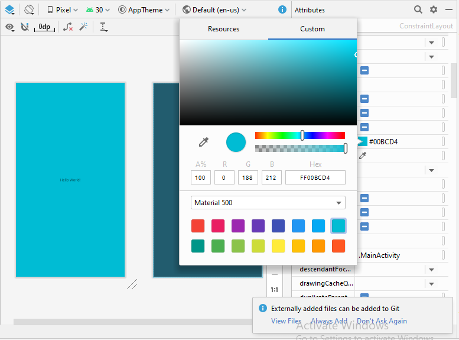

# 01 - Hello World

## Tujuan Pembelajaran

1. Mahasiswa mampu menyelesaikan soal Kuis 1 MIT App Inventor
2. Mahasiswa mampu menginstall Android Studio, Android SDK, dan konfigurasi Kotlin
3. Mahasiswa Mampu menginstall Emulator
4. Mahasiswa Mampu Menghubungkan Perangkat Mobile Ke Komputer / Laptop
5. Mahasiswa mampu melakukan instalasi Git dan mengkonfigurasikannya di Android Studio

## Hasil Praktikum 

### Program Hello World menggunakan Java Android Studio

1. Untuk membuat project baru, pada Android Studio Menu, klik File->New->New Project

2. Akan muncul Create New Project Window, kemudian pilih Empty Activity untuk membuat Blank Activity, lalu klik Next

3. Langkah berikutnya yaitu menentukan project name pada field Name dengan nama project 01_hello_world, lalu mendefinisikan tempat direktori penyimpanan project pada Sace Location, pilih Java language dan API 21:Android 5.0 (Lollipop), terakhir klik Next

4. Tunggu proses Loading Project hingga finish

5. Buka activity_main.xml pada res/layout maka akan tampil template Empty Layout

6. Klik di dalam area layout preview kemudian klik background pada Attribute pane untuk mengubah warna background

7. Pada kolom custom klik salah satu warna untuk mengaplikasikan background color, contoh warna tosca

8. Klik TextView Hello World!, pada attribute pane klik dropdown pada textSize kemudian pilih 36p untuk mengubah ukuran font

9. Masih pada TextView, klik flag logo pada textStyle dalam attribute pane, kemudian check pada bold untuk membuat tulisan menjadi tebal, lalu klik Apply

10. Untuk melakukan deploy pada device, pada dropdown Run Dialog pilih app, pada dropdown device configuration pilih samsung, lalu klik button segitiga hijau, tunggu beberapa saat untuk proses building 

11. Setelah proses finished, maka aplikasi Hello Word sederhana akan tampil pada device kita
