# 02 - Layout

## Tujuan Pembelajaran

1. Mahasiswa memahami konsep layout pada android.
2. Mahasiswa memahami konsep View Group dan Hierarchy pada layout
3. Mahasiswa mampu membuat layout sederhana.
4. Mahasiswa menguasai layout editor dan kegunaannya pada android studio

## Hasil Praktikum

### Objective : Start an Android Studio Project with blank layout

Start a new Android Studio Project

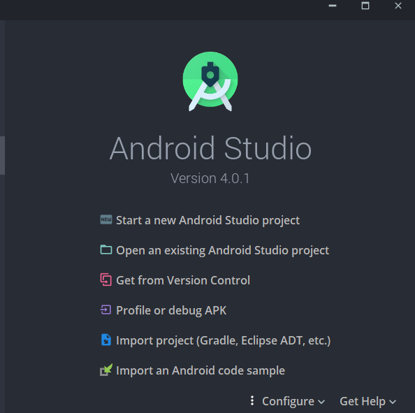

 Set up your project refer with this specification : 
 “Choose Your Project” dialog : 
&nbsp;&nbsp;&nbsp;&nbsp;a) Select “Empty Activity” 
“Configure Your Project” dialog : 
&nbsp;&nbsp;&nbsp;&nbsp;b) Name: BasicAppX 
&nbsp;&nbsp;&nbsp;&nbsp;c) Package name: org.aplas.basicappx 
&nbsp;&nbsp;&nbsp;&nbsp;d) Save Location: any 
&nbsp;&nbsp;&nbsp;&nbsp;e) Language: Java 
&nbsp;&nbsp;&nbsp;&nbsp;f) Minimum API Level: API 21/Android 5.0 Lollipop 
&nbsp;&nbsp;&nbsp;&nbsp;g) This project will support instant apps: Uncheck 
&nbsp;&nbsp;&nbsp;&nbsp;h) Use android.* artifacts: Check 

 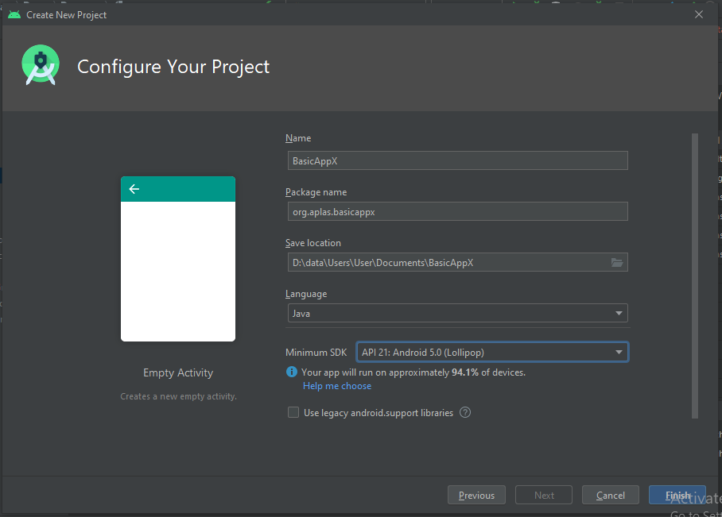

Change the content of “build.graddle (Module: app)” file like below, then Sync it. Continue to set up your project refer with this specification.

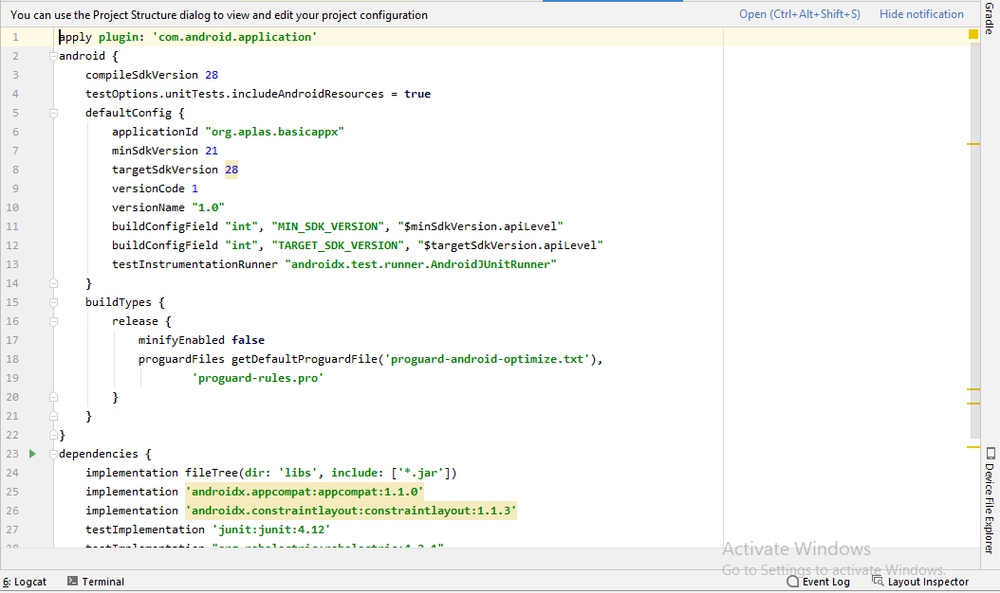

Copy “TestA1BasicUI011X.java” and “ViewTest.java” file to “org.aplas.basicappx (test)” folder

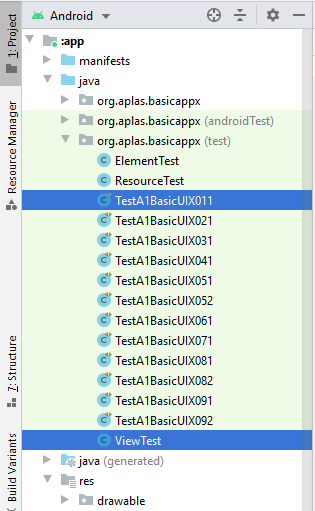

Right click on the “TestA1BasicUIX011.java” file then choose Run ‘TestA1BasicUIX011’ and click it. It may take long time to execute. 
(TestA1BasicUIX011)

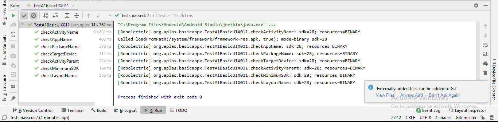

### Objective : Configure Android Studio project resources, like string and font

Create “font” folder under “res” folder. Right click on the “res” folder and choose “New –Adroid Resource Directory”. 

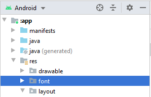

Copy file “cambria.ttf” and “lucida.ttf” in Supplement folder to “font” folder that already created. 

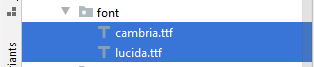

Edit the value of all “string” name as described below.

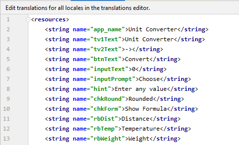

Open “colors.xml” file under “res/values” folder and edit the value of all “color” name as described below.

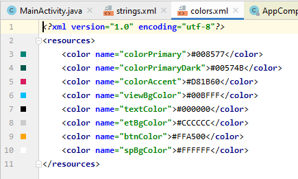

Right click on the “TestA1BasicUIX021.java” file then choose Run ‘TestA1BasicUIX021’ and click it. It may take long time to execute.

(TestA1BasicUIX021)

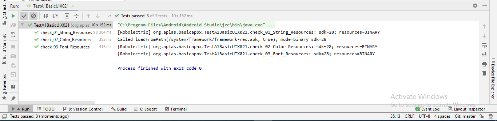

### Objective : Design basic layout, add TextView, and add a Button

On the layout xml editor, delete default “ConstraintLayout” with all its tag and create an “RelativeLayout” with id “mainLayout” as a main layout refer on the specification below.

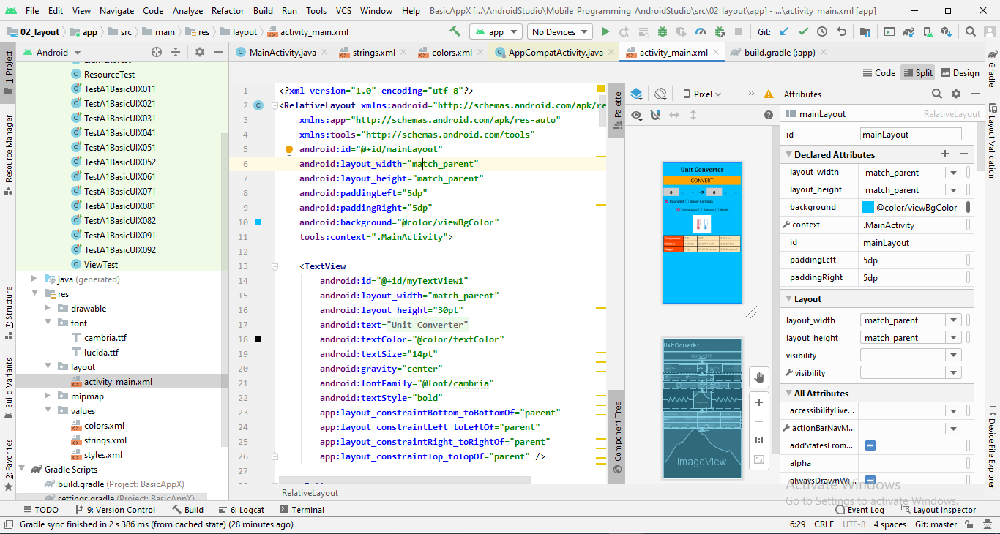

In the RelativeLayout tag, add a TextView with id “myTextView1” refer in specification below.

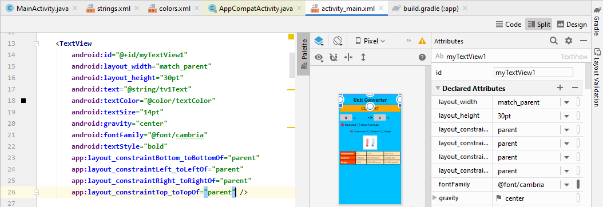

(TestA1BasicUIX031)

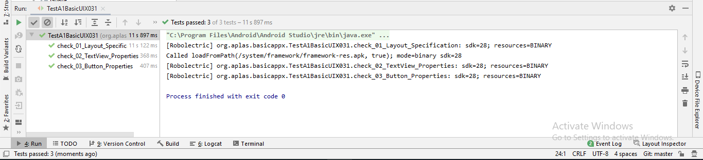

Objective : Make Space and add Child Layout

On the layout xml editor, create an “Space” with id “space” refer on the specification below.

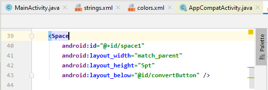

Under the Space, add a LinearLayout as Child Layout with id “child1” refer on specification below.

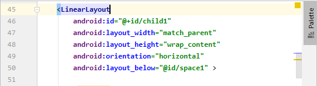

Right click on the “TestA1BasicUIX041.java” file then choose Run ‘TestA1BasicUIX041’ and click it. It may take long time to execute

(TestA1BasicUIX041)

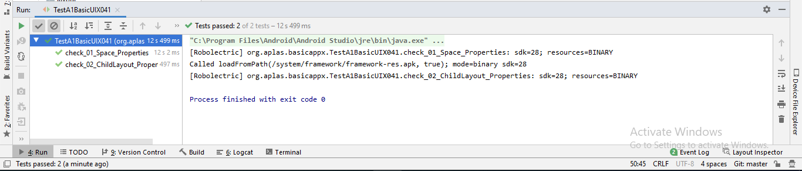

### Objective : Configure color resources, make EditText, and Spinner

Add the value of all “string-array” name as described in specification below.

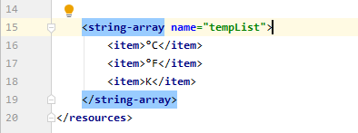

In the LinearLayout “child1” tag, add an EditText with id “inputText” refer on specification below.

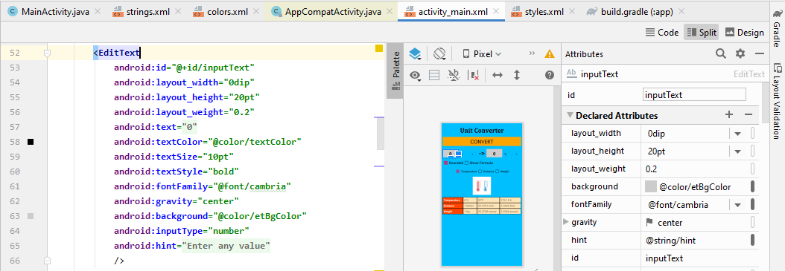

Under EditText, add a Spinner with id “oriList” refer on specification document.

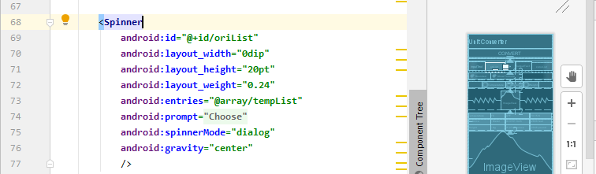

Right click on the “TestA1BasicUIX051.java” file then choose Run ‘TestA1BasicUIX051’ and click it. It may take long time to execute. Do it for “TestA1BasicUIX052.java” file also.

(TestA1BasicUIX051)

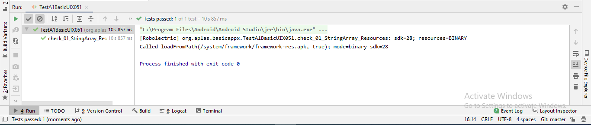

(TestA1BasicUIX052)

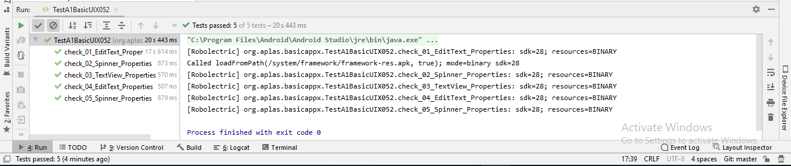

### Objective : Make CheckBox 

Under LinearLayout “child1”, create a LinearLayout with id “child2” refer on the specification below.

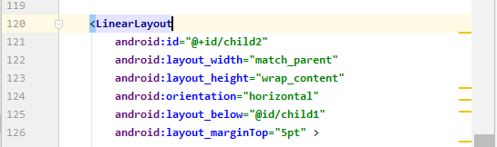

In the “child2” tag, add a CheckBox with id “chkRounded” refer on specification below.

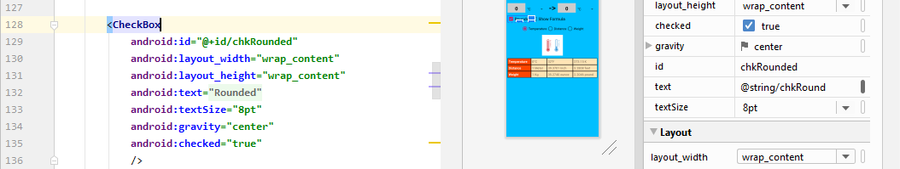

Right click on the “TestA1BasicUIX061.java” file then choose Run ‘TestA1BasicUIX061’ and click it. It may take long time to execute.

(TestA1BasicUIX061)

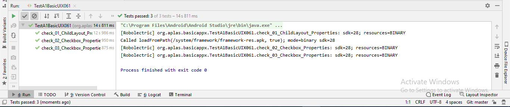

### Objective : Make RadioGroup and RadioButton

Under LinearLayout “child2”, create a RadioGroup with id “radioGroup” refer on the specification in specification below.

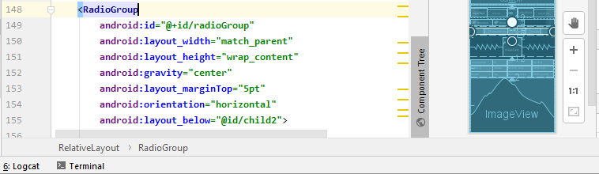

In the “radioGroup” tag, add 3 RadioButton(s) with id “rbTemp”, “rbDist”, and “rbWeight” refer on specification below. 

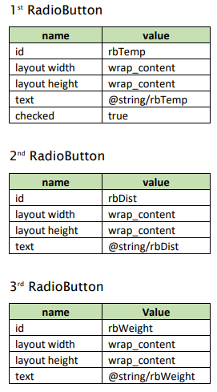

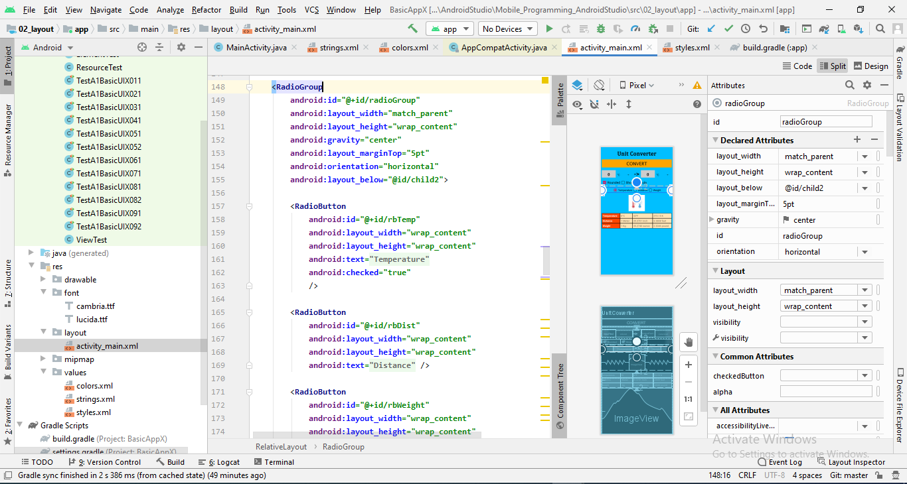

Right click on the “TestA1BasicUIX071.java” file then choose Run ‘TestA1BasicUIX071’ and click it. It may take long time to execute.

(TestA1BasicUIX071)

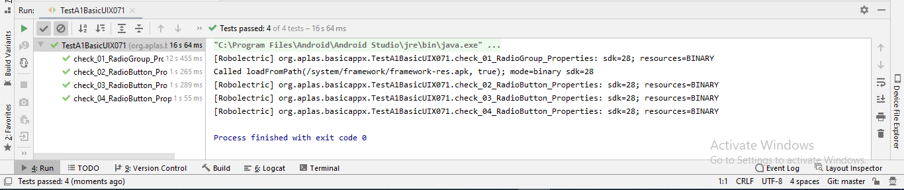

### Objective : Add image resource and make an ImageView

Copy file “temperature.jpg” in Supplement folder to “drawable” folder under “res” folder. 

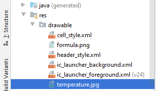

Under RadioGroup “radioGroup”, create an ImageView with id “img” refer on the specification below.

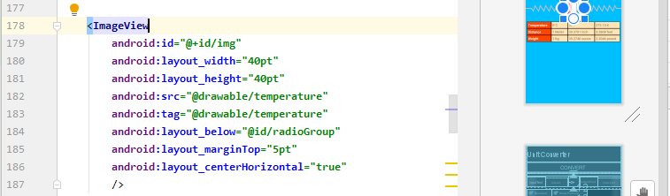

Right click on each test file(s) then choose Run and click it. It may take long time to execute.

(TestA1BasicUIX081)

(TestA1BasicUIX082)

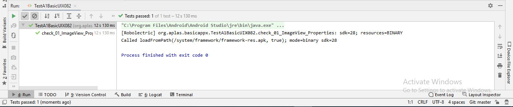

### Objective : Add drawable resource and make a Table

Copy file “cell_style.xml” and “header_style.xml” in Supplement folder to “drawable” folder under “res” folder.

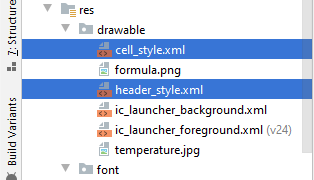

Under ImageView “img”, create a TableLayout with id “table” refer on the specification in specification below.

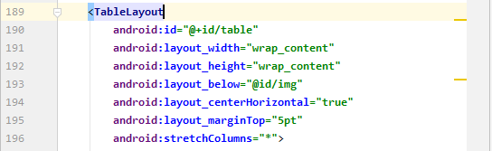

Under TableLayout, create an ImageView with id “imgFormula” refer on the specification below.

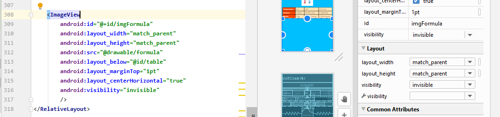

Right click on each test file(s) then choose Run and click it. It may take long time to execute.

(TestA1BasicUIX091)

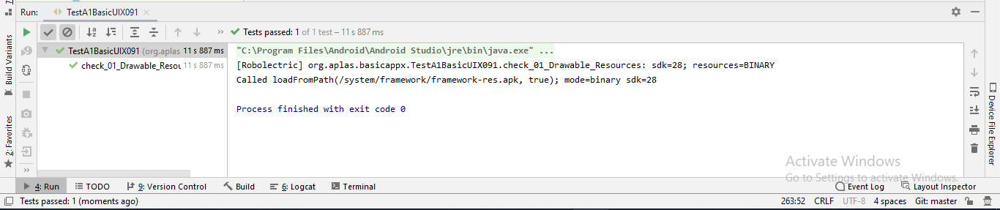

(TestA1BasicUIX092)

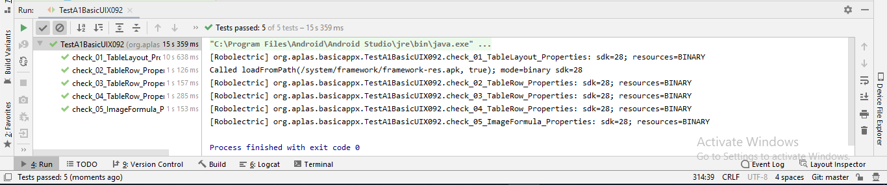

### Hasil deploy aplikasi pada device android

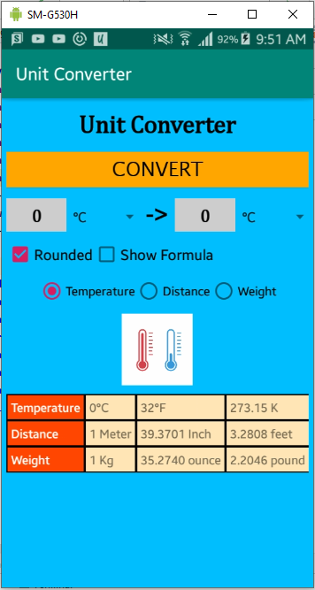