# 03 - Activity

## Tujuan Pembelajaran

1. Mahasiswa mampu melakukan pengujian, debugging, dan menggunakan pustaka dukungan.
2. Mahasiswa mampu memodifikasi program kalkulator
sederhana menjadi aplikasi yang layak digunakan.

## Hasil Praktikum

### Objective : Create a Temperature class to convert unit

Create a new Temperature class, located in same folder with MainActivity

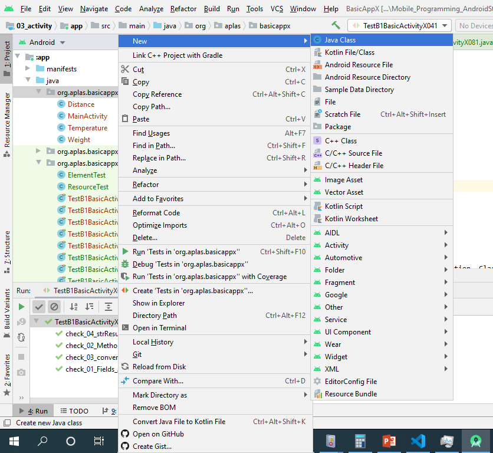

 Create a private field with name “celcius” and data type double. 

 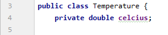

Make a constructor with blank parameter. This constructor initiates field “celcius” with 0 value. 

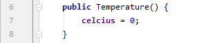

Make three set Method to assign “celcius” field refer on this formula: 

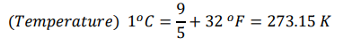

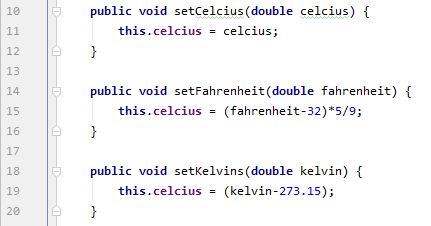

Make three get Method (function) to return a double value of convert unit from “celcius” field

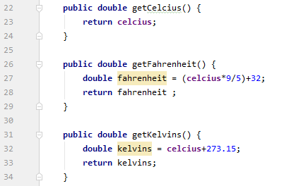

Make a “convert” method (function) to return a double value that convert from a unit (original) to another one (converted) as a return value. Utilize the get and set methods to create algorithm of this method.

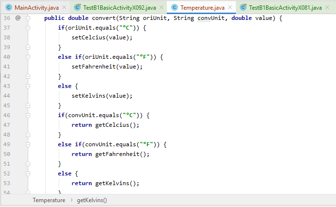

Right click on the “TestB1BasicActivityX011.java” file then choose Run ‘TestB1BasicActivityX011’ and click it. It may take long time to execute.

(TestB1BasicActivityX011)

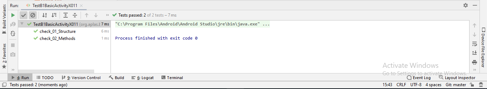

### Objective : Create a Distance class to convert unit

Create a new Distance class, located in same folder with MainActivity.

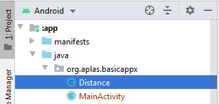

Create a private field with name “meter” and data type double. 

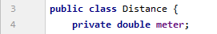

Make a constructor with blank parameter. This constructor initiates field “meter” with 0 value. 

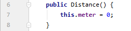

Make four set Method to assign “meter” field  

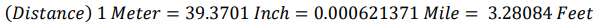

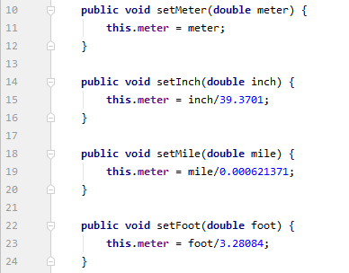

Make four get Method (function) to return a double value of convert unit from “meter” field

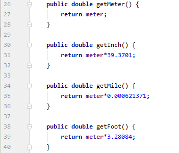

Make a “convert” method (function) to return a double value that convert from a unit (original) to another one (converted) as a return value. Utilize the get and set methods to create algorithm of this method.

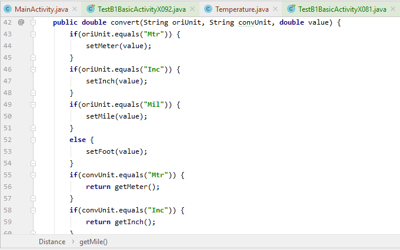

Right click on the “TestB1BasicActivityX021.java” file then choose Run ‘TestB1BasicActivityX021’ and click it. It may take long time to execute.

(TestB1BasicActivityX021)

### Objective : Create a Weight class to convert unit

Create a new Weight class, located in same folder with MainActivity. 

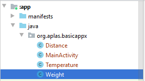

Create a private field with name “gram” and data type double. 

Make a constructor with blank parameter. This constructor initiates field “gram” with 0 value. 

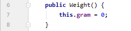

Make three set Method to assign “gram” field 

Make three get Method (function) to return a double value of convert unit from “gram” field 

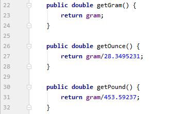

Make a “convert” method (function) to return a double value that convert from a unit (original) to another one (converted) as a return value. Utilize the get and set methods to create algorithm of this method.

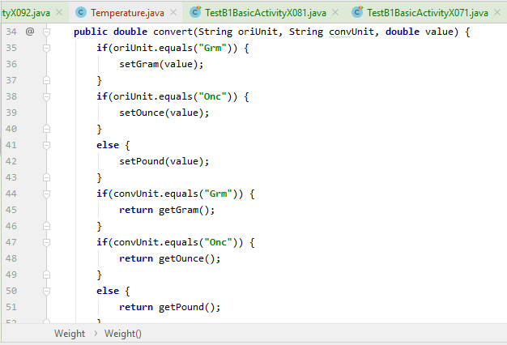

Right click on the “TestB1BasicActivityX031.java” file then choose Run ‘TestB1BasicActivityX031’ and click it. It may take long time to execute.

(TestA1BasicUIX031)

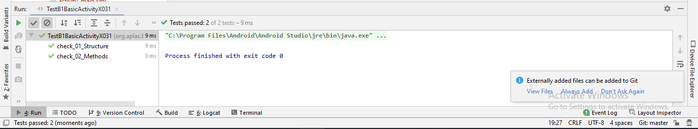

### Objective : Make fields and methods in main activity class

Make some fields with this description

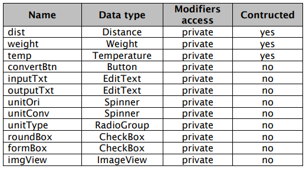

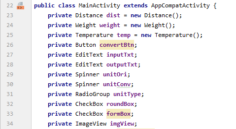

“convertUnit” method (function) will return a double value that convert from a unit (original) to another one (converted) as a return value. Utilize the “convert” methods in Temperature, Distance, and Weight class to create algorithm of this method.

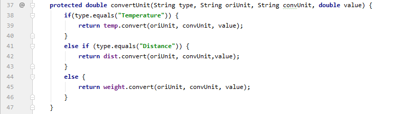

Right click on the “TestB1BasicActivityX041.java” file then choose Run ‘TestB1BasicActivityX041’ and click it. It may take long time to execute.

(TestB1BasicActivityX041)

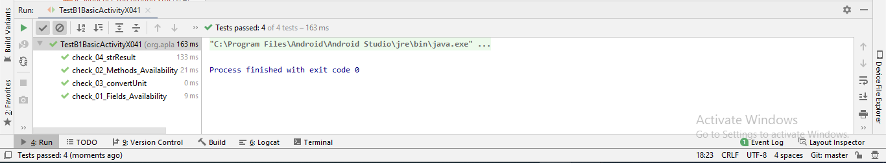

### Objective : Understand about activity lifecycle when on Create and on Start

Make sure method “onCreate” is already written

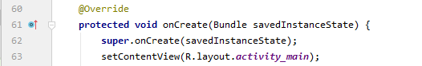

Under syntax number 4, assign every field of layout elements that defined in task 2.01.04 with the resource in activity.

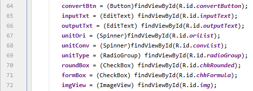

Make a “onStart” method under the “onCreate” method like below 

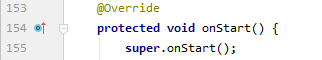

Right click on the “TestB1BasicActivityX051.java” file then choose Run ‘TestB1BasicActivityX051’ and click it. It may take long time to execute

(TestB1BasicActivityX051)

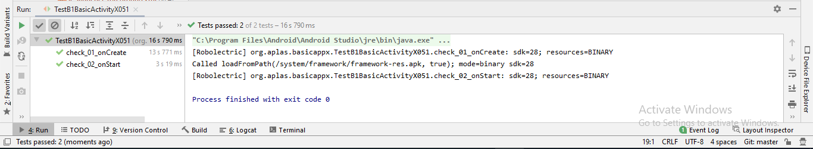

### Objective : Understand about RadioGroup changed event and how to change Spinner content.

Add the value of all “string-array” name as described in specification below 

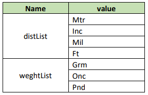

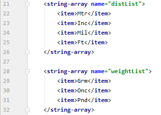

Copy file “distance.png” and “weight.png” in Supplement folder to “drawable” folder under “res” folder. 

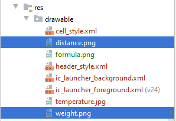

Open MainActivity.java and create an event when “unitType” Radiogroup inside onCreate method. 
&nbsp;&nbsp;&nbsp;Code to make event Radiogroup changed:

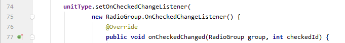

Right click on the “TestB1BasicActivityX061.java” file then choose Run ‘TestB1BasicActivityX061’ and click it. It may take long time to execute.

(TestB1BasicActivityX061)

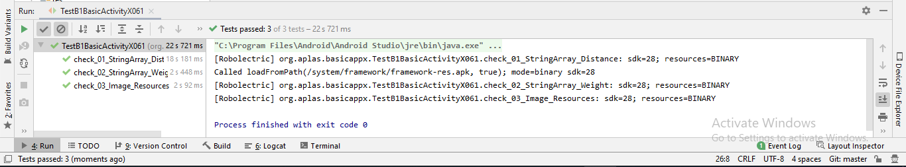

### Objective : Create a method to do conversion

Open MainActivity.java and create a new void method with name “doConvert”

Make an algorithm to convert value from inputTxt and put the result to outputTxt depend on unit that selected on oriList and convList. 

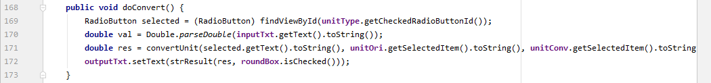

Right click on the “TestB1BasicActivityX071.java” file then choose Run ‘TestB1BasicActivityX071’ and click it. It may take long time to execute.

(TestB1BasicActivityX071)

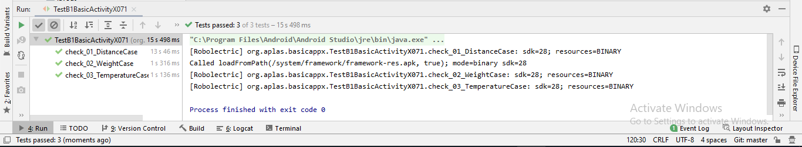

### Objective : Make some events action for Button, Spinner, and CheckBox

Create an event listener to catch event when “convertButton” clicked, with this example. 
Then call method “doConvert()” in that event action.

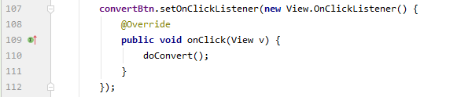

Create an event listener to catch event when “oriList” changed, with this example. 
Then call method “doConvert()” in that event action.

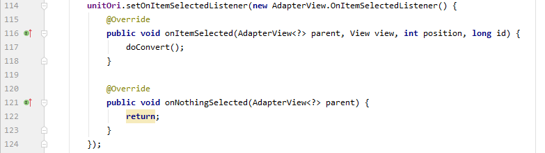

Right click on the “TestB1BasicActivity081.java” file then choose Run ‘TestB1BasicActivity081’ and click it. It may take long time to execute.

(TestB1BasicActivity081)

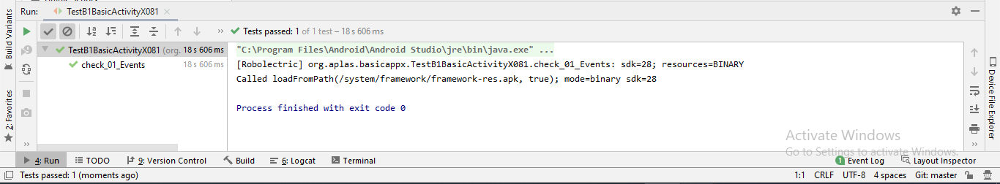

### Objective : Create a new image element and fill it when formula checkbox checked

Copy file “formula.png” in Supplement folder to “drawable” folder under “res” folder. 

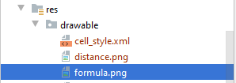

Under TableLayout, create an ImageView with id “imgFormula” refer on the specification below.

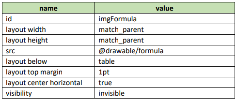

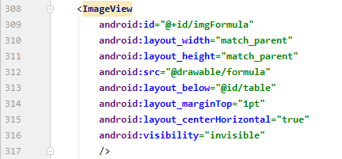

Create an event listener to catch event when“roundBox” changed

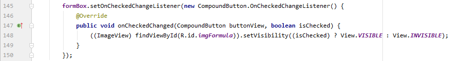

Right click on the “B1BasicActivityX091.java” file then choose Run ‘B1BasicActivityX091’ and click it. It may take long time to execute.

(TestB1BasicActivityX091)

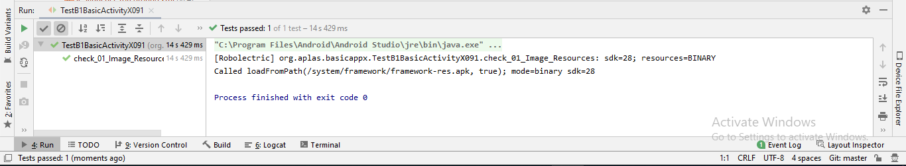

Then right click on the “B1BasicActivityX092.java” file then choose Run ‘B1BasicActivityX092’ and click it. It may take long time to execute.

(TestB1BasicActivityX092)

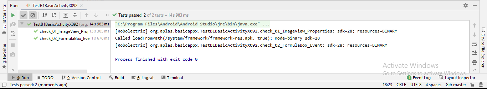

### Hasil deploy aplikasi pada device android

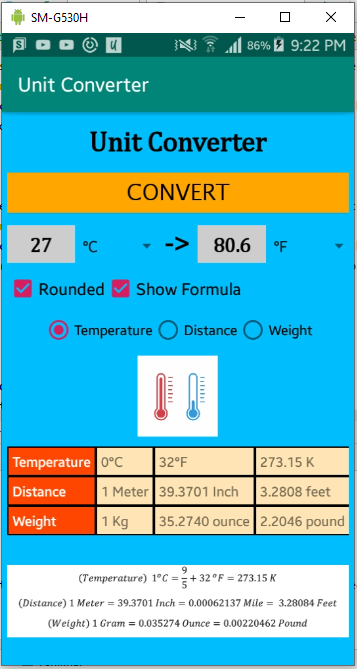