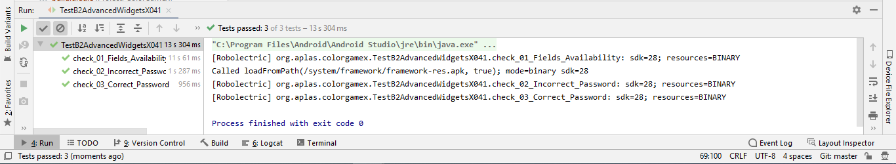

# 04 - Advanced Widgets

## Tujuan Pembelajaran

1. Mahasiswa mampu melakukan pengujian, debugging, dan menggunakan pustaka dukungan.
2. Mahasiswa mampu memodifikasi program kalkulator
sederhana menjadi aplikasi yang layak digunakan.

## Hasil Praktikum

### Objective : Create simple game Android application. First with project configuration and resource configuration.

Create New Project on Android Studio and choose “Add No Activity”, then Next. 

  
 

 Project Configuration.
- Project Name: ColorGameX
- Package Nam: org.aplas.colorgamex
- Project Location: any
- Language: Java
- Target API Level: Android 5.0 (Lollipop)
- Support instant apps: uncheck
- AndroidX: check 

  

Open colors.xml 

 

Add some colors like this table 

Open strings.xml. Add some strings and integers like this table 

 
 

Still in strings.xml, add array string 

 
 

Open styles.xml. 

 

Change the “AppTheme” configuration be like this: 

 

Create new Empty Activity with this menu. 

 

In the dialog, use this configuration (must be correct) :
- Activity name: MyActivity
- Generate Layout File: Checked
- Layout name: activity_layout
- Launcher activity: Checked
- Backwards Compatibility: Unchecked (if appears)
- Package: org.aplas.colorgamex
- Language: Java 
Then click Finish 

 

Open MyActivity.java. 

 

Open AndroidManifest.xml. 

 

Change the value of project configuration be like this:
- label: APLAS COLOR GAME
- theme: @style/AppTheme
- activity name: MyActivity
- Launcher activity: Checked
- Backwards Compatibility: Unchecked (if appears)
- Package: org.aplas.colorgame
- Language: Java 

 

Change the content of “build.graddle (Module: app)” file like below, then Sync it. 

 
 

Copy “ElementTest.java, ResourceTest.java, ViewTest.java,TestB2AdvancedWidgetsX011.java and TestB2AdvancedWidgetsX011.java” file to “org.aplas.colorgamex (test)” folder. 

 

Right click on the “TestB2AdvancedWidgetsX011.java” file then choose Run ‘TestB2AdvancedWidgetsX011’ and click it. It may take long time to execute. 

(TestB2AdvancedWidgetsX011) 

 

Right click on the “TestB2AdvancedWidgetsX012.java” file then choose Run ‘TestB2AdvancedWidgetsX012’ and click it. It may take long time to execute. 

(TestB2AdvancedWidgetsX012) 

 

### Objective : Understand about style, theme, and drawable vector image

Copy “ic_resicon.xml” in the supplement folder to “drawable” 

Create new drawable shape. Right click drawable click New drawable resource 

File name: round_btn, then click ok 

 

Open the file and define a shape in the “round_btn.xml” with this code.  

In the shape tag, define 4 tag values with this specification 

 
 

Right click on the “TestB2AdvancedWidgetsX021.java” file then choose Run ‘TestB2AdvancedWidgetsX021’ and click it. It may take long time to execute. 

(TestB2AdvancedWidgetsX021)

### Objective : Make the UI for project of Color Game with some onClick attribute.

On the layout xml editor, delete default “ConstraintLayout” with all its tag and create an “LinearLayout” with id “mainLayout” as a main layout refer on the specification below. 

In the LinearLayout (mainLayout) tag, add a TextView with id “appTitle” refer in specification below. 

Under TextView appTitle, add a LinearLayout with id “accessBox” refer in specification below.  

Under LinearLayout accessBox, add a LinearLayout with id “colorBox” refer in specification below.  

Under LinearLayout colorBox, add a RelativeLayout with id “buttonBox1” refer in specification below.  

Right click on the “TestB2AdvancedWidgetsX031.java” file then choose Run ‘TestB2AdvancedWidgetsX031’ and click it. It may take long time to execute. 

(TestB2AdvancedWidgetsX031)

### Objective : Declare fields needed by application and define method to check validity to enter the game

Declare some fields in MyActivity class, with this description 

 
 

In the “onCreate” method, assign each declared field with related view resource. Refer on below 

 

Right click on the “TestB2AdvancedWidgetsX041.java” file then choose Run ‘TestB2AdvancedWidgetsX041’ and click it. It may take long time to execute. 

(TestB2AdvancedWidgetsX041)

### Objective : Understand how Countdowntimer works

Open “MyActivity.java” file and add new fields in MyActivity class, with this description. 

 
 

Create a new private void method with name “initTimer” and blank parameters. 

In the “initTimer” method, define the countdown field with CountDownTimer definition, like below. 

Call “initTimer” method in the “onCreate” method, like below. 

Right click on the “TestB2AdvancedWidgetsX051.java” file then choose Run ‘TestB2AdvancedWidgetsX051’ and click it. It may take long time to execute. 

(TestB2AdvancedWidgetsX051)

### Objective : Understand how access array from resource and put it into List and Hashtable

Open “MyActivity.java” file and add new fields in MyActivity class, with this description. 

Create a new private void method with name “initColorList” and blank parameters. 

In the “initColorList” method, assign “clrList” with color data from “colorList” resource with this code. 

Then declare a temporary String[] variable “temp” and assign it with “charList” resource. 
Both String array (clrList and temp) will have same length (5). 
Do together, put each element of “clrList” into “charList” as key, and put each element of “temp” into “charList” as value. Use this code. 

Call “initColorList” method in the “onCreate” method, like below. 

Right click on the “TestB2AdvancedWidgetsX061.java” file then choose Run ‘TestB2AdvancedWidgetsX061’ and click it. It may take long time to execute. 

(TestB2AdvancedWidgetsX061)

### Objective : Understand how start the timer to start the game

Open “MyActivity.java” file and add new fields in MyActivity class, with this description. 

Create a new function method with name “getNewRandomInt” with int output and 3 parameters. This method to get new random int between min and max, also with 1 number exception.

Create a new private void method with name “newGameStage” and blank parameters. 

In the "newGameStage" method, do these steps.  
Then declare a String[] variable “clrTxt” and assign it with string inTextView “clrText” like this code 

Declare an int variable “lastNum” and assign it with related index of “clrText” in array “clrList” like this code.

Declare an int variable “colorIdx” and assign it with random integer between 0-5 like this code and exception number “lastNum”. Use “getNewRandomInt” method.

Right click on the “TestB2AdvancedWidgetsX071.java” file then choose Run ‘TestB2AdvancedWidgetsX071’ and click it. It may take long time to execute. 

(TestB2AdvancedWidgetsX071)

### Objective : Understand how to handle timer and calculate the score

Create a new private method with name “updateScore” with 1 int paramenter. This method will update the progress in ProgressBar and text in “scoreText” with number refer on paramenter. 

Create a new private method with name “correctSubmit” with blank parameters.
This method will response if user submit correct color. 

In the “correctSubmit” method, do these steps.  
Declare new int “newScore” and assign it with currect progress value add with value of “counter” in Resource. Then call method “updateScore” with “newScore” as parameter. 

 

Check the progress was already reach maximum score or not with this comparison. 

 

If reached (comparison true), then write this code 

 

else (if not reached), call method “newGameStage” 

 

Right click on the “TestB2AdvancedWidgetsX081.java” file then choose Run ‘TestB2AdvancedWidgetsX081’ and click it. It may take long time to execute

(TestB2AdvancedWidgetsX081)

### Hasil deploy aplikasi pada emulator

 
 
 