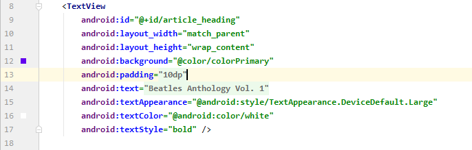
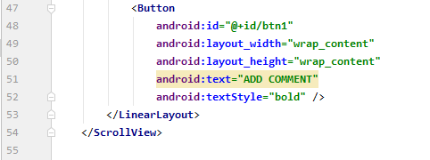

# 05 - Scroll View

## Tujuan Pembelajaran

1. 
2. 

## Hasil Praktikum

### Create the project and TextView elements

In this task you will create the project and the TextView elements, and use TextView attributes for styling the text and background.  

In Android Studio create a new project with the following parameters: 

  
 

Change this ViewGroup to RelativeLayout. The second line of code now looks something like this: 

  

The block of XML code at the top now looks like this: 

 

Enter the following attributes for the TextView. As you enter each attribute and value, suggestions appear to complete the attribute name or value. 

 

Add another TextView element above the "Hello World" TextView and below the TextView you created in the previous steps. Add the following attributes to the TextView: 

 

### Add the text of the article

In the app > res > values folder, open strings.xml. 
Enter the values for the strings article_title and article_subtitle with either a made-up title and subtitle, or use the values in the strings.xml file of the finished ScrollingText app. Make the string values single-line text without HTML tags or multiple lines. 

 

### Add the autoLink attribute for active web links

Add the android:autoLink="web" attribute to the article TextView. The XML code for this TextView now looks like this: 

 

### Add a ScrollView to the layout

Add a ScrollView between the article_subheading TextView and the article TextView. 

The code for the two TextView elements and the ScrollView now looks like this: 

 

### Add a LinearLayout to the ScrollView

Add a LinearLayout above the article TextView within the ScrollView.  

The code at the beginning of the ScrollView now looks like this: 

 

### Move UI elements within the LinearLayout

The LinearLayout now has only one UI element—the article TextView. You want to include the article_subheading TextView in the LinearLayout so that both will scroll. 

1. Remove the android:layout_below="@id/article_heading" attribute from the article_subheading TextView. 

2. Change the ScrollView layout attribute from android:layout_below="@id/article_subheading" to android:layout_below="@id/article_heading". 

The XML code for the ScrollView is now as follows: 

  
 

### Coding challenge

Add another UI element—a Button—to the LinearLayout inside the ScrollView so that it scrolls with the text. 

 

### Run the app

  
  
 

### Homework

1. Change the subheading so that it wraps within a column on the left that is 100 dp wide, as shown below. 

 

2. Place the text of the article to the right of the subheading as shown below. 

  
