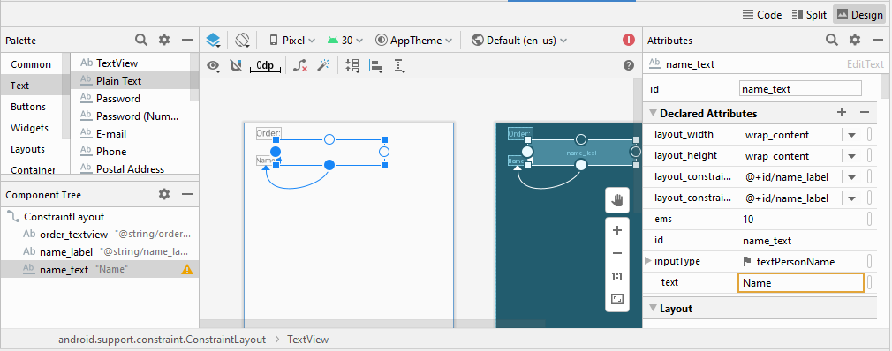
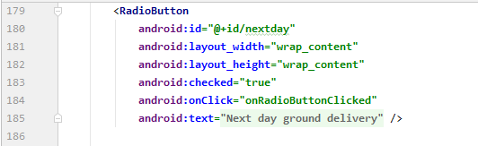

# 06 - Input Control

## Tujuan Pembelajaran

1. Mahasiswa mampu melakukan pengujian, debugging, dan menggunakan pustaka dukungan.
2. Mahasiswa mampu memodifikasi program kalkulator
sederhana menjadi aplikasi yang layak digunakan.

## Hasil Praktikum

### Add an EditText for entering a name

Make a copy of the DroidCafe app from the lesson on using clickable images, and rename the copy to DroidCafeInput. If you didn't complete the coding challenge in that lesson, download the DroidCafeChallenge project and rename it to DroidCafeInput. 

 

Open the activity_order.xml layout file, which uses a ConstraintLayout. 

 

Add a TextView to the ConstraintLayout in activity_order.xml under the order_textview element already in the layout. Use the following attributes for the new TextView: 

 

Add an EditText element. To use the visual layout editor, drag a Plain Text element from the Palette pane to a position next to the name_label TextView. Then enter name_text for the ID field, and constrain the left side and baseline of the element to the name_label element right side and baseline as shown in the figure below: 

 

The figure above highlights the inputType field in the Attributes pane to show that Android Studio automatically assigned the textPersonName type. Click the inputType field to see the menu of input types: 

 

Add a hint for text entry, such as Enter your name, in the hint field in the Attributes pane, and delete the Name entry in the text field. As a hint to the user, the text "Enter your name" should be dimmed inside the EditText. 

 

The following attributes should be set for the new EditText (add the layout_marginLeft attribute for compatibility with older versions of Android): 

 

### Add a multiple-line EditText

1. Open the activity_order.xml layout file if it is not already open. 
2. Add a TextView under the name_label element already in the layout. Use the following attributes for the new TextView: 

 

Check the XML code for the layout by clicking the Text tab 
The following attributes should be set for the new EditText (add the layout_marginLeft attribute for compatibility with older versions of Android): 

 

### Use a keypad for phone numbers

Add a TextView under the address_label element already in the layout. Use the following attributes for the new TextView: 

 

The following attributes should be set for the new EditText 

 

### Combine input types in one EditText

Add a TextView under the phone_label element already in the layout. Use the following attributes for the new TextView: 

 

Check the XML code for the layout by clicking the Text tab. 
The following attributes should be set for the new EditText (add the layout_marginLeft attribute for compatibility with older versions of Android): 

 

### Add a RadioGroup and radio buttons

Switch to editing XML, and make sure that you have the following attributes set for the new TextView:  

 

To add radio buttons, enclose them within a RadioGroup. Add the RadioGroup to the layout underneath the TextView you just added, enclosing three RadioButton elements as shown in the XML code below: 

 

### Add the radio button click handler

Choose Create onRadioButtonClicked(View) in OrderActivity in the red bulb's menu. Android Studio creates the onRadioButtonClicked(View view) method in OrderActivity: 

 

To display which radio button is clicked (that is, the type of delivery the user chooses), use a Toast message. Open OrderActivity and add the following displayToast method: 

 

In the new onRadioButtonClicked() method, add a switch case block to check which radio button has been selected and to call displayToast() with the appropriate message. The code uses the isChecked() method of the Checkable interface, which returns true if the button is selected. It also uses the View getId() method to get the identifier for the selected radio button view:

 

Run the app. Tap an image to see the OrderActivity activity, which shows the delivery choices. Tap a delivery choice, and you see a Toast message at the bottom of the screen with the choice, as shown in the figure below. 

 
 

### Coding challenge

The radio buttons for delivery choices in the DroidCafeInput app first appear unselected, which implies that there is no default delivery choice. Change the radio buttons so that one of them (such as nextday) is selected as the default when the radio buttons first appear. 

 

 

### Use a spinner for user choices

To look at the XML code for activity_order.xml, click the Text tab. 

The Spinner should have the following attributes: 

 

The phone_text element should now have the following attributes (after using the pack tool): 

 

### Add code to activate the Spinner and its listener

Click the light bulb and select Implement methods. The onItemSelected() and onNothingSelected() methods, which are required for OnItemSelectedListener, should be highlighted, and the "Insert @Override" option should be selected. Click OK. 

 

This step automatically adds empty onItemSelected() and onNothingSelected() callback methods to the bottom of the OrderActivity class. Both methods use the parameter AdapterView&lt;?&gt;. The &lt;?&gt; is a Java type wildcard, enabling the method to be flexible enough to accept any type of AdapterView as an argument. 4. Instantiate a Spinner in the onCreate() method using the label_spinner element in the layout, and set its listener (spinner.setOnItemSelectedListener) in the onCreate() method, as shown in the following code snippet: 

 

The Spinner appears next to the phone entry field and shows the first choice (Home). Tapping the Spinner reveals all the choices, as shown on the left side of the figure below. Tapping a choice in the Spinner shows a Toast message with the choice, as shown on the right side of the figure. 

  
 

### Coding challenge 2

Write code to perform an action directly from the keyboard by tapping a Send key, such as for dialing a phone number 

For this challenge, create a new app project 

  
 

Add an EditText that uses the android:inputType attribute set to phone. Use the android:imeOptions attribute for the EditText element with the actionSend value: 

 

In the onCreate() method for this Activity, you can use setOnEditorActionListener() to set the listener for the EditText to detect if the key is pressed: 

 

The next step is to override onEditorAction() and use the IME_ACTION_SEND constant in the EditorInfo class to respond to the pressed key. In the example below, the key is used to call the dialNumber() method to dial the phone number: 

 

To finish the challenge, create the dialNumber() method, which uses an implicit intent with ACTION_DIAL to pass the phone number to another app that can dial the number. It should look like this: 

 

Run the app 

  
 

### Homework

1. Create an app with five checkboxes and a Show Toast button, as shown below. 

  
 

2. Add these code below to get the id from resource consist of CheckBox and Button, then display the selected checkbox message into toast 

  
 

### Run the app and it shoud be something like below 

  
  
 