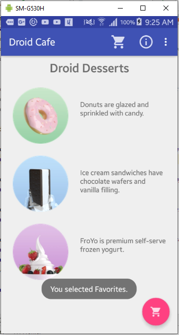
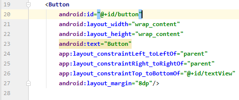
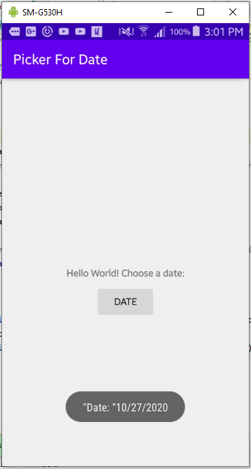
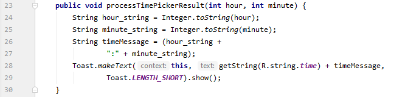

# 07 - Menus and Pickers

## Tujuan Pembelajaran

1. Mahasiswa mampu membuat aplikasi yang menggunakan Input Keyboard
2. Mahasiswa mampu membuat aplikasi dengan alert dialog

## Hasil Praktikum

### Add items to the options menu

Open the DroidCafeInput app from the practical on using input controls and examine the following layout files in the res > layout folder 

- content_main.xml: The layout for the content of the MainActivity screen, which (as you will see shortly) is included within activity_main.xml. 

 

### Add more menu items to the options menu

Expand res > menu in the Project > Android pane, and open menu_main.xml. 

Add a new menu item using the &lt;item&gt; tag within the &lt;menu&gt; block, and give the item the following attributes 

 

Add two more menu items the same way with the following attributes 

 

You will display a Toast message with an action message depending on which menu item the user selects. Open strings.xml and add the following string names and values for these messages 

 

Open MainActivity, and change the if statement in the onOptionsItemSelected() method replacing the id action_settings with the new id action_order 

 

Run the app, and tap the action overflow icon, to see the options menu, shown on the figure below. You will soon add callbacks to respond to items selected from this menu. 

 

### Add icons for menu items

To specify icons for actions, you need to first add the icons as image assets to the drawable folder using the same procedure you used in the practical on using clickable images. 

For the Status and Favorites icons, follow these steps: 

1. Expand res in the Project > Android pane, and right-click (or Control-click) the drawable folder.
2. Choose New > Image Asset. The Configure Image Asset dialog appears.
3. Choose Action Bar and Tab Items in the drop-down menu.
4. Change ic_action_name to another name (such as ic_status_info for the Status icon).
5. Click the clip art image (the Android logo next to Clipart:) to select a clip art image as the icon. A page of icons appears. Click the icon you want to use.
6. Choose HOLO_DARK from the Theme drop-down menu. This sets the icon to be white against a dark-colored (or black) background. Click Next and then click Finish. 

 

### Show the menu items as icons in the app bar

Open menu_main.xml again, and add the following attributes to the Order, Status, and Favorites items so that the first two (Order and Status) always appear, and the Favorites item appears only if there is room for it 

 

Run the app. You should now see at least two icons in the app bar: the icon for Order and the icon for Status as shown on the figure below. (The Favorites and Contact options appear in the overflow menu.) 

 

Rotate your device to the horizontal orientation, or if you're running in the emulator, click the Rotate Left or Rotate Right icons to rotate the display into the horizontal orientation. You should then see all three icons in the app bar for Order, Status, and Favorites as shown on the figure below 

 

### Create a method to display the menu choice

Open MainActivity. 

If you haven't already added the following method (in another lesson) for displaying a Toast message, add it now. You will use it as the action to take for each menu choice. (Normally you would implement an action for each menu item such as starting another Activity, as shown later in this lesson.) 

 

### Use the onOptionsItemSelected event handler

Find the onOptionsItemSelected() method provided by the template. The method determines whether a certain menu item was clicked, using the menu item's id. In the example below, the id is action_order 

Replace the int id assignment statement and the if statement with the following switch case block, which sets the appropriate message based on the menu item's id 

 

Run the app. You should now see a different Toast message on the screen, as shown on the figure below, based on which menu item you choose 

  
 

### Start an Activity from a menu item

Referring the snippet from the previous task, change the code for the action_order case to the following, which start OrderActivity (using the same code you used for the floating action button in the lesson on using clickable images)  

 

### Coding challenge

For this challenge, add a context menu to the ScrollingText app to show three options: Edit, Share, and Delete. The menu appears when the user performs a touch & hold on the TextView. The app then displays a Toast message showing the menu option chosen. 

Right-click the res folder and choose New > Android Resource Directory 

 

Choose menu in the Resource type drop-down menu and click OK. 

 

Then right-click the new menu folder

 

Choose New > Menu resource file, enter the name menu_context, and click OK

 

In the onCreate() method, register the TextView 

 

Implement the onCreateContextMenu() method in the Activity to inflate the menu. 

 

Implement the onContextItemSelected() method in the Activity to handle menu-item clicks. In this case, simply display a Toast with the menu choice. 

 

Run the app. If you tap and drag, the text scrolls as before. However, if you do a long tap, the contextual menu appears.

  
  
 

### Create a new app to show an alert dialog

In this exercise, you build an alert with OK and Cancel buttons. The alert is triggered by the user tapping a button. 

Create a new project called Dialog For Alert based on the Empty Activity template. 

 

Edit the TextView element to say Hello World! Tap to test the alert: instead of "Hello World!" 

 

1. Add a Button under the TextView. (Optional: Constrain the button to the bottom of the TextView and the sides of the layout, with margins set to 8dp.)
2. Set the text of the Button to Alert.
3. Switch to the Text tab, and extract the text strings for the TextView and Button to string resources.
4. Add the android:onClick attribute to the button to call the click handler onClickShowAlert(). After you enter it, the click handler is underlined in red because it has not yet been created. 

 

### Add an alert dialog to the main activity

Open MainActivity and add the beginning of the onClickShowAlert() method 

 

Add the code to set the title and the message for the alert dialog to onClickShowAlert() after the comment 

 

Add the OK and Cancel buttons to the alert with setPositiveButton() and setNegativeButton() methods 

 

At the end of the onClickShowAlert() method, add show(), which creates and then displays the alert dialog. 

 

Run the app

  
  
 

### Create a new app to show a date picker

Create a new project called Picker For Date based on the Empty Activity template. 

 

Edit the TextView element's "Hello World!" text to Hello World! Choose a date 

 

1. Add a Button underneath the TextView. (Optional: Constrain the Button to the bottom of the TextView and the sides of the layout, with margins set to 8dp.)
2. Set the text of the Button to Date.
3. Switch to the Text tab, and extract the strings for the TextView and Button to string resources. 

 

### Create a new fragment for the date picker

In this step, you add a Fragment for the date picker. 

Expand app > java > com.example.android.pickerfordate and select MainActivity. 

Choose File > New > Fragment > Fragment (Blank) 

 

Name the fragment DatePickerFragment. Clear all three checkboxes so that you don't create a layout XML, include fragment factory methods, or include interface callbacks. You don't need to create a layout for a standard picker. Click Finish. 

 

Open DatePickerFragment and edit the DatePickerFragment class definition to extend DialogFragment and implement DatePickerDialog.OnDateSetListener to create a standard date picker with a listener 

 

The onDateSet() parameters should be int i, int i1, and int i2. Change the names of these parameters to ones that are more readable 

 

Replace the entire onCreateView() method with onCreateDialog() that returns Dialog, and annotate onCreateDialog() with @NonNull to indicate that the return value Dialog can't be null. Android Studio displays a red bulb next to the method because it doesn't return anything yet 

Add the following code to onCreateDialog() to initialize the year, month, and day from Calendar, and return the dialog and these values to the Activity. As you enter Calendar.getInstance(), specify the import to be java.util.Calendar 

 

### Modify the main activity

Add the showDatePickerDialog() handler for the Date Button. It creates an instance of FragmentManager using getSupportFragmentManager() to manage the Fragment automatically, and to show the picker. 

 

### Use the chosen date

Open MainActivity and add an empty processDatePickerResult() method that takes the year, month, and day as arguments 

Add the following code to the processDatePickerResult() method to convert the month, day, and year to separate strings, and to concatenate the three strings with slash marks for the U.S. date format 

 

Add the following after the code above to display a Toast message 

 

Open DatePickerFragment, and add the following to the onDateSet() method to invoke processDatePickerResult() in MainActivity and pass it the year, month, and day 

 

Run the app. After selecting the date, the date appears in a Toast message as shown on the following figure. 

  
  
 

### Coding challenge 2

Create a new project called Picker For Time based on the Empty Activity template. 

 

Open TimePickerFragment and edit the TimePickerFragment class definition to extend DialogFragment and implement TimePickerDialog.OnTimeSetListener to create a standard time picker with a listener. 

 

Open TimePickerFragment, and add the following to the onTImeSet() method to invoke processTimePickerResult() in MainActivity and pass it the hour and minute 

 

Add the following code to onCreateDialog() to initialize the hour and minute from Calendar, and return the dialog and these values to the Activity. As you enter Calendar.getInstance(), specify the import to be java.util.Calendar. 

 

Add the following code to the processTimePickerResult() method to convert the hour and minute to separate strings, and to concatenate both of strings with colon mark

 

Run the app. After selecting the time, the time appears in a Toast message as shown on the following figure. 

  
  
 

### Homework

Open the DroidCafeOptions app that you created in this lesson.

1. Add a Date button under the delivery options that shows the date picker.
2. Show the user's chosen date in a Toast message. 

Add a Button underneath the RadioGroup 

Set the text of the Button to Date 

Add the android:onClick attribute to the Button to call the click handler showDatePicker(). 

 

Add the following code to onCreateDialog() to initialize the year, month, and day from Calendar, and return the dialog and these values to the Activity. As you enter Calendar.getInstance(), specify the import to be java.util.Calendar. 

 

Add the showDatePickerDialog() handler for the Date Button. It creates an instance of FragmentManager using getSupportFragmentManager() to manage the Fragment automatically, and to show the picker. 

 

Add the following code to the processDatePickerResult() method to convert the month, day, and year to separate strings, and to concatenate the three strings with slash marks for the U.S. date format. 

 

Open DatePickerFragment, and add the following to the onDateSet() method to invoke processDatePickerResult() in MainActivity and pass it the year, month, and day. 

 

Run the app. After selecting the date, the date appears in a Toast message as shown on the following figure 

  
  
 