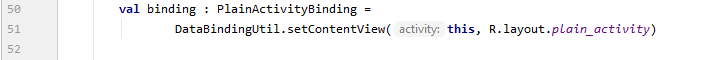
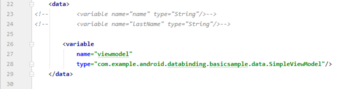
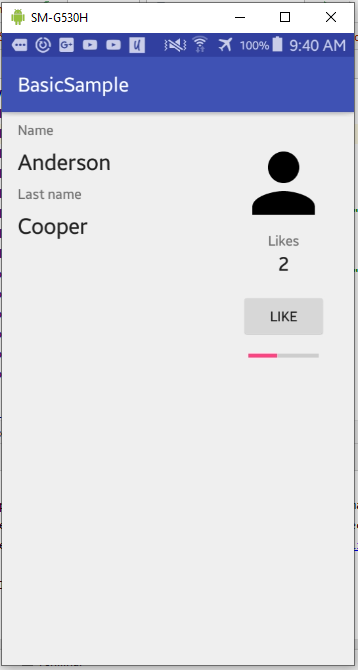
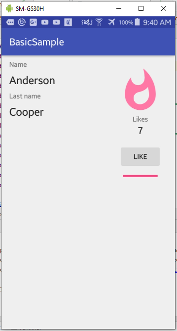

# 08 - Data Binding

## Tujuan Pembelajaran

1. Mahasiswa mampu melakukan konfigurasi databinding pada project Android
2. Mahasiswa mampu menerapkan databinding pada project Android

## Hasil Praktikum

### Try out the app without Data Binding

In this step, you download the code for the entire codelab and then run a simple example app. 

 

Once the project is open, click Run 'app' or simply press Shift+F10 to run the app. 

Once the build is complete and the app is deployed to your device or emulator, the default activity opens and looks like this 

 

### Enable Data Binding and convert the layout

In order to convert the layout to Data Binding, you need to wrap the root element in a \<layout\> tag. You'll also have to move the namespace definitions (the attributes that start with xmlns:) to the new root element. 

 

Now, let's bind some data!

### Create your first layout expression

Let's start with some static data binding for now.

- Create two String layout variables inside the <data> tag. 

 

- Look for the TextView with the ID plain_name and add the android:text attribute with a layout expression 

 

- Do the same thing with the plain_lastName text view 

 

Now we need to modify the Activity so that it inflates a Data Binding layout correctly

### Change inflation and remove UI calls from activity

The layout is ready, but now it's necessary to make some changes in the activity. Open PlainOldActivity and inflate the plain_activity layout with this code 

 

To see what a generated class looks like, open PlainActivitySolutionBinding, and take a look around. 

- Now you can set the variable values 

 

You can start removing old code: 

- Remove the updateName() method, since the new Data Binding code is now finding the IDs and setting the text values. 

- Remove the updateName() call in onCreate() 

 

### Dealing with user events

Before modifying the event handling code, you can clean up the layout a bit. 

- First, replace the two variables for a single ViewModel. This is the way to go in the majority of cases since it keeps your presentation code and state in one place. 

 

Instead of accessing the variables directly, call the viewmodel properties: 

- Change the layout expressions in both TextViews  

  

 

Also, update how clicks on the "Like" button are handled. 

 

Now, remove things you don't need from the activity to use a viewmodel binding with this code 

 

### Observing data

There are multiple ways to implement observability. You can use observable classes, observable fields, or, the preferred way, LiveData.  

 

Then set the LiveData's value with the value proprty and make one LiveData depend on another using Transformations also edit the fun onLike() with these snippet below

 

Open PlainOldActivity and set the lifecycle owner in the binding object 

 

Let's bind the TextView showing the number of likes to the observable integer. In plain_activity.xml 

 

### Using Binding Adapters to create custom attributes

In the plain_activity layout, look for the progress bar and add the hideIfZero attribute 

 

### Create a Binding Adapter with multiple parameters

Next, add the attributes to the XML 

 

### Practice creating Binding Adapters

Practice makes perfect. Create: 

- a Binding Adapter that tints the color of the progress bar depending on the value of likes and adds the corresponding attribute
- a Binding Adapter that shows a different icon depending on the popularity:
- ic_person_black_96dp in black
- ic_whatshot_black_96dp in light pink
- ic_whatshot_black_96dp in bold pink 

Add the app:popularityIcon attribute to bind the popularity from viewmodel with this code below 

 

### Run the app

  

  

  

