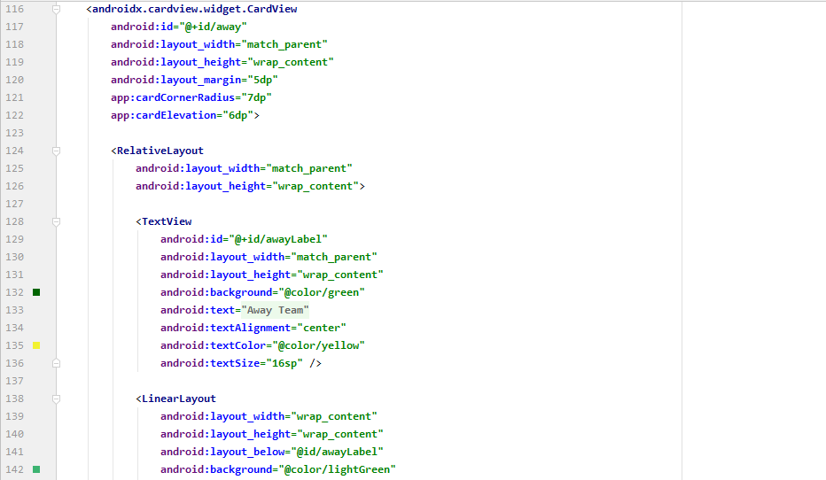
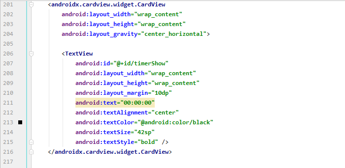
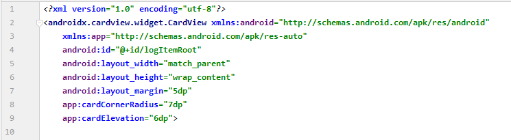
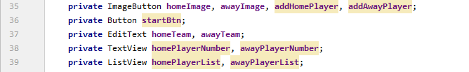
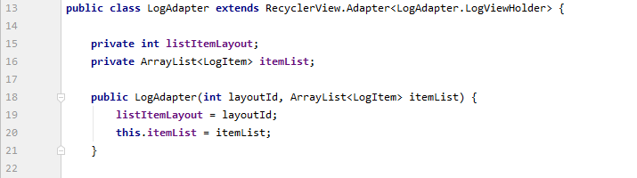

# 09 - Fragment

## Tujuan Pembelajaran

1. Mahasiswa mampu mengkonversi multi activity menjadi single activity multi Fragment
2. Mahasiswa mampu memasang dan menerapkan navigation component

## Hasil Praktikum

### Student start to create a project configuration and resource configuration

Create New Project on Android Studio and choose “Empty Activity”, then Next 

  

 

Project Configuration.
- Project Name: SoccerMatch
- Package Nam: org.aplas.soccermatch
- Project Location: any
- Language: Java
- Target API Level: Android 6.0 (Marshmallow)
- Support instant apps: uncheck
- AndroidX: check 
Then Click Finish. 

 

Configure the necessary string resource(s) 

 

Configure the necessary drawable resource(s)
Copy all pictures in supplement folder to drawable resource folder in Android
Studio:
- icon_add_button.png
- icon_goal.png
- icon_next.png
- icon_player.png
- icon_red_card.png
- icon_reload.png
- icon_yellow_card.png
- socceranim.gif
- teamlogo.png 

 

Change the content of “build.graddle (Module: app)” file like below, then Sync it. 

 

Right click on the “TestB3MultiActivities011 java” file then choose Run. It may take long time to execute. 

 

### Student will start to design the Main layout as first layout that contains CardView, ListView, ImageButton, TextView, EditText, and Button.

Open “activity_main.xml” in layout resource folder. Change the root layout become “LinearLayout” and give id “mainLayout” and orientation “vertical”. 

 

Create a CardView to put title TextView with this code 

Add a TextView in the CardView, with id = “mainTitleTxt” and text get from the “app_title” string resource that contains string “APLAS SOCCER BOARD”. 

 

Create a new CardView to put some widgets for Home Team data. You can setup your own CardView with your own Id, color, and other styling information. Inside this home Team CardView, put some these necessary widgets 

  
  
 

Create a new CardView to put some widgets for Away Team data. You can setup your own CardView with your own Id, color, and other styling information. Inside this home Team CardView, put some these necessary widgets 

  
  
 

Add a Button at the bottom of layout with this specification: 

  
 

Right click on the “TestB3MultiActivities021.java” file then choose Run. It may take long time to execute. 

 

### Student will start to design the Play layout as second layout that contains CardView, ImageButton, ImageView, TextView, Fragment Container, and Button.

Create a new Empty Activity 

 

With this specification: 
- Activity name : PlayActivity
- Generate layout file : checked
- Layout name : activity_play
- Launcher activity : uncheck
- Package name : org.aplas.soccermatch
- Language : Java 

 

Open “activity_play.xml” in layout resource folder. Change the root layout become “LinearLayout” and give id “playLayout” and orientation “vertical”. 

 

Add a TextView in the CardView, with id = “playTitleTxt” with text value “Soccer
Match Score”. 

 

Create a new CardView to put some widgets for Home Team data. You can setup your own CardView with your own Id, color, and other styling information. Inside this home Team CardView, put some these necessary widgets 

  
  
 

Create a new CardView to put some widgets for Away Team data. You can setup your own CardView with your own Id, color, and other styling information. Inside this home Team CardView, put some these necessary widgets 

  
  
 

Insert a TextView with text: “vs” between two block of CardView home and away team. The sample result could be like below. 

 

Create a new TextView to show match time with this specification:
- Id : timerShow
- Text: “00:00:00”
- textAlignment: center 
Put this TextView in a new CardView. 

 

Create two new Buttons: 

  
 

Create a new FrameLayout to show the fragment with Id: footer. 

 

Create a new Blank Fragment like below: 

 

Use these information below:
- Fragment name : FooterFragment
- Fragment Layout Name : fragment_footer
- Language : Java 

 

Right click on the “TestB3MultiActivities031.java” file then choose Run. It may take long time to execute. 

 

### Student will start to design the Log layout as third layout that contains TextView, RecyclerView, and Button.

Create a new Empty Activity with this specification:
- Activity name : LogActivity
- Generate layout file : checked
- Layout name : activity_log
- Launcher activity : uncheck
- Package name : org.aplas.soccermatch
- Language : Java 

  
 

Open “activity_log.xml” in layout resource folder. Change the root layout become “LinearLayout” and give id “logLayout” and orientation “vertical”. 

 

Create two new TextView at top of layout 

 

Create a new RecyclerView to show the match log with Id: logRcView 

 

Right click on the “TestB3MultiActivities041.java” file then choose Run. It may take long time to execute. 

 

### Student will start to design the layout of list, layout of dialog, layout of match log, and layout of footer fragment.

Make layout of list. Create a new layout resource with this way 

 

After a dialog opened, use this specification:
- File name : layout_list
- Root element : LinearLayout
- Source set : main
- Directory name : layout 

 

Open “layout_list.xml” in layout resource folder and set orientation of LinearLayout “vertical”. 

 

Add a TextView with this specification:
- Id : listItem
- padding : 2dp
- layout_width : fill_parent
- layout_height : wrap_content
- text : \<empty> 

 

Make layout of dialog. Create a new layout resource like before with this
specification:
- File name : layout_dialog
- Root element : LinearLayout
- Source set : main
- Directory name : layout 

 

Add an EditText with this specification:
- Id : playerName
- layout_width : match_parent
- layout_height : wrap_content
- text : \<empty> 

 

Make layout of log. Create a new layout resource like before with this specification:
- File name : layout_log
- Root element : LinearLayout
- Source set : main
- Directory name : layout 

 

Open “layout_log.xml” in layout resource folder and change LinearLayout to CardView layout with id = logItemRoot. Set the attributes of CardView by yourself. 

 

In this CardView layout, add these widgets 

  
 

Open “fragment_footer.xml” in layout resource folder set the LinearLayout orientation to “vertical” and set id = footerLayout. 

 

Add a CardView in the “footerlayout” and set CardView id = playCard. Set the attributes of CardView by yourself 

In this CardView layout, add these widgets 

  

 

Right click on the “TestB3MultiActivities051.java” file then choose Run. It may take long time to execute. 

 

### Student will start programing for MainActivity. This task will introduce how to handle ListView, open image selector intent, show a dialog, and go to another intent.

Open “MainActivity.java” in java folder folder. 

Declare all variables that represents all widgets in activity_main.xml 

 

Also define some variables like below 

  
 

In the onCreate method, define all widgets variables, which has been declared in point 1, to the related widget id 

 

Then, to show a dialog to input player name, we must create a new method to activate a AlertDialog, like below 

 

Then, in the ‘onCreate’ method, assign ‘homeDialog’ and ‘awayDialog’ button with the init method, like below 

 

Then put onClickListener still in the ‘onCreate’ method for each addPlayer buttons to show the AlertDialog when it clicked. 

 

Create a new method to load a ListView content from an ArrayList of String.
- First we must declare an ArrayAdapter of String variable and contruct the
object with context, a layout resource, a widget inside layout resource, and
an ArrayList of String.
- Then we set the adapter of ListView with the ArrayAdapter variable. 

 

In the onCreate method, create a temporary variable with data type ArrayList<String>. Put a string "add 11 players" in that variable. 

Then use the method to update the ‘homePlayerList’ and ‘awayPlayerList’ ListView
content with the temporary ArrayList variable 

 

Now we create a method to process selected image when the Image Gallery opened. We must create an override method ” onActivityResult”. 

In the code, we have to handle the 2 possibility if the user select an image or not. 

 

In the onCreate method, create an OnClickListener for ImageButton ’homeImage’ and ‘awayImage’ with call method ‘onActivityResult’. 

 

Create a method to check the completeness of main form to activate the start button. 

 

Then, create a new method ‘openPlayActivity’ again to activate an Intent of ‘PlayActivity’ with passing some necessary variables. 

 

In the onCreate method, create an OnClickListener for Button ‘startBtn’ with calling method ‘openPlayActivity’ when the form is complete 

 

Right click on the “TestB3MultiActivities061.java” file then choose Run. It may take long time to execute 

 

### Student start programming with PlayActivity

Open “PlayActivity.java” in java folder folder. 

Declare all variables that represents all widgets in activity_play.xml 

 

Also define some variables like below. 

  
 

In the onCreate method, define all widgets variables, which has been declared in point 1, to the related widget id. 

 

To load the data from MainActivity as former Intent, create a methor ‘loadTeamData’. 

 

Then, to show the Footer as a fragment, create a method like below. 

 

Then, create an Override method ‘onStart’ which calls method in point 6 and 7, like below. 

 

Create a new method to set the Enabled of match Buttons, like below. 

 

Create a new method to response when start Button is clicked, like below. 

 

In the onCreate method, create an OnClickListener for Button ’startMatch’ with call method ‘startBtnClick’ in point 9 like below. 

 

Create a Runnable class to run the Timer in background, like below. 

 

Create a new method to add Event which is shown on Footer fragment, like below. 

 

Create a new method to add Score which is shown on main screen, like below. 

 

In the onCreate method, create an OnClickListener for Button ’finishMatch’ with call method ‘openLogActivity’ 

 

Right click on the “TestB3MultiActivities071.java” file then choose Run. It may take long time to execute. 

 

### Student start programming with LogActivity

Open “LogActivity.java” in java folder folder. 

Declare all variables that represents all widgets in activity_main.xml 

 

In the onCreate method, define all widgets variables, which has been declared in point 1, to the related widget id 

 

Still in the onCreate method, set some properties of the RecyclerView with this code. 

 

Create a new Java class for Log adapter with name ‘LogAdapter.java 

 

In the ‘LogAdapter’ class, create some variables and a constructor. 

 

Then, add an Override method to get list size. 

    

Then, add an Override method to specify the layout of each row 

 

Then, add an Override method to load data for each row elements. 

 

Again, create a new Java class for Log item with name ‘LogItem.java’, and modify
the code, like below. 

  
 

Back to LogActivity.java, create a new method to load the header part of activity 

 

Create a new method to load the data of RecyclerView. 

 

Create an Override method ‘onStart’ to call the method in point 8 and 9. Write by your self 

 

Create a new method to show MainActivity as Intent with passing some variables, like below. 

 

In the onCreate method, create an OnClickListener for Button ’restartBtn’ with call method ‘openMainActivity’. 

 

Right click on the “TestB3MultiActivities081.java” file then choose Run. It may take long time to execute. 

 

After you finish, you can run and try the app. The result should be similar like below. 

  
 