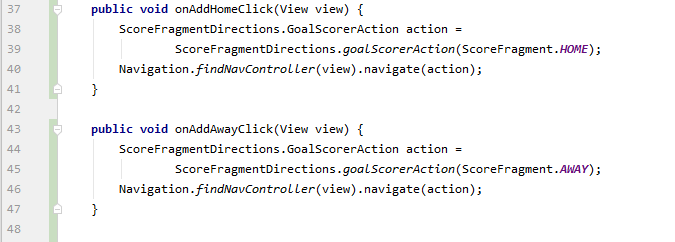

# 10 - ViewModel

## Tujuan Pembelajaran

1. Mahasiswa mengenal tentang arsitektur MVVM
2. Mahasiswa memahami lifecycle viewmodel pada MVVM
3. Mahasiswa mampu menerapkan viewmodel pada android

## Hasil Praktikum

Klik dan clone tautan starter project yang telah dibagikan oleh masing-masing dosen pengampu 

 

Buka starter code yang telah disiapkan dengan menggunakan Android Studio. Amati susunan file/directory yang terdapat pada starter code. 

 

Pada project skor dibutuhkan dua informasi skor pada tim Home dan Away sehingga dibutuhkan dua buah atribut livedata. Tambahkan kode seperti yang ada di bawah. 

 

Penggunaan ViewModel bertujuan juga untuk memisahkan logika dengan UI. Tambahkan logika untuk menampilkan nilai Skor masing-masing tim pada viewmodel. 

 

Tambahkan logika untuk penambahan pencetak gol dengan kode sebagai berikut. Penambahan pencetak gol berdasarkan informasi tim yang mencetak gol. 

 

Selain pemisahan logika, dalam viewmodel juga dapat digunakan untuk pemisahan interaksi dengan pengguna. Tambahkan kode berikut untuk menambahkan interaksi pada tombol. 

 

Buka berkas ScoreFragment.java dan lakukan instansiasi viewmodel pada method onCreateView(). 

 

Buka berkas GoalFragment.java dan lakukan instansiasi viewmodel pada method onCreateView() dengan cara yang sama. 

 

Buka kembali berkas ScoreFragment.java, dalam project ini digunakan juga databinding sehingga perlu proses untuk menghubungkan viewmodel. Tambahkan proses binding viewmodel dengan kode berikut. 

 

Kemudian untuk menambahkan interaksi penambahan pencetak gol, silahkan tambahkan kode berikut pada method onSaveClicked(). 

 

Buka kembali ScoreFragment.java, tambahkan proses untuk set Fragment dan LifecycleOwner dalam proses binding viewmodel. 

 

### Tantangan

Tampilkan data pemain beserta menit gol terjadi untuk masing-masing tim pada id text_home_scorer dan text_away_scorer dengan menggunakan konsep viewmodel. 

Tambahkan variable dengan attribute name berupa fragment pada layout resource fragment_score dalam element data seperti kode di bawah ini.  

 

Tambahkan method dengan tipe data String untuk mereturnkan value name dan minute pada homeGoalScoreList dengan kode seperti berikut. 

 

Begitu pula untuk awayGoalScoreList dengan cara yang cama seperti diatas yaitu mereturnkan value dari StringBuilder yang merupakan nilai dari awalGoalScoreList. 

 

Run your app, it will show the player name and goal in minute for each of those team concurrently. 

 