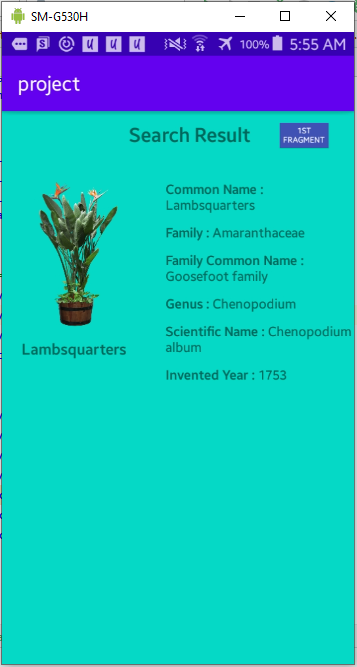

# 11 - Quiz 2

## Tujuan Pembelajaran

1. Ujian praktikum dengan materi minggu ke 9-11

## Hasil Kuis

Enable Data Binding library in the module that will use it as the following code 

 

Convert the regular main_activity layout to Data Binding, you need to wrap the root element in a \<layout> tag 

 

You will see the new \<data> tag that used to write layout variable and expressions like the following snippet 

 

Add a TextView to write your title at the top of your main layout as following 

 

Create a horizontal-oriented LinearLayout to align both of EditText that handle the user input and a search button 

 

Make an ImageView to display the drawable image file and add a TextView to give a description or title corresponding to the precedence item, all of them inside the \<LinearLayout> tag 

 

Do the same for the rest until they completely fill the whole screen. 

 

Create the new MainActivityVM as a viewmodel with the following code 

 

Then declare the new variable to handle the user input from main activity with the name something like bindTextInputParam and onClickSearch() method to handle the search button click and start another activity 

 

Make a new activity with name ResultActivity that act as a logic data flow related to the setting content view from DataBindingUtil and assigned to ActivityResultBinding, intent thing and some another logical work. 

 

Add a void method that receives string and context parameter to get and pass the search argument and start that activity 

 

Add a new ResultActivityVM as another viewmodel and create a new bindTextParam variable then make a new method to set the result of layout text variable like the snippet below 

 

Edit the MainActivity file and bind the data source to UI layout and create a buttonClickListener to handle the activity inside the Intent with the following code 

 

Make a new fragment_color layout with the root \<FrameLayout> tag and declare the new background color variable to distinguish between the main and second fragment 

 

Do a copy from your main fragment layout including the whole element contained there to make the second layout same as the first one to make sure that the content persists without the bg color 

 

Generate with your own ColorFragment file to handle the transition between one fragment to another and inflate the destination fragment 

  

 

## Screenshoot Hasil Aplikasi

The Data Binding Library used to bind the user input parameter into the activity_result layout in this case user search the name of the plant and send the data to anoher layout and show the result with the exact word as user did 

This Project uses the fragment to switch the background color from one fragment to another or vice-versa, the first fragment doesn't apply the background color and the second fragment use all the same element as the first but the background color 

Navigation used to move between one fragment or activity to another in this project. There are three different layouts to navigate from one to another  

The viewmodel in this project designed to manage the data related to the User Interface therefore those datas could be used again if there is some change in user configuration 

  

  

  

  

