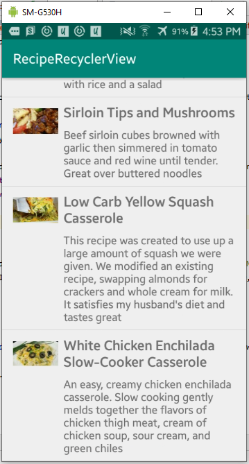

# 12 - RecyclerView

## Tujuan Pembelajaran

1. Pengenalan Recycler View
2. Menambahkan Recycler View ke Project Android.
3. Menampilkan data dari Room Persistence.
4. Membuat ViewHolder
5. Menampilkan Detail Data.

## Hasil Praktikum

Create a new project with the name RecyclerView, select the Basic Activity template, and generate the layout file. 

  
 

Open MainActivity and add a private member variable for the mWordList linked list. 

 

Add code within the onCreate() method that populates mWordList with words 

 

For this practical, you will use a FAB to generate a new word to insert into the list. The Basic Activity template provides a FAB, but you may want to change its icon. 

1. Expand res in the Project > Android pane, and right-click (or Control-click) the drawable folder.
2. Choose New > Image Asset. The Configure Image Asset dialog appears. 

 

3. Choose Action Bar and Tab Items in the drop-down menu at the top of the dialog.
4. Change ic_action_name in the Name field to ic_add_for_fab.
5. Click the clip art image (the Android logo next to Clipart:) to select a clip art image as the icon. A page of icons appears. Click the icon you want to use for the FAB, such as the plus (+) sign. 

 

6. Choose HOLO_DARK from the Theme drop-down menu. This sets the icon to be white against a dark-colored (or black) background. Click Next. 

 

7. Click Finish in the Confirm Icon Path dialog. 

 

To add a RecyclerView element to the XML layout, follow these steps 

1. Open content_main.xml in your RecyclerView app. It shows a "Hello World" TextView at the center of a ConstraintLayout.
2. Replace the entire TextView element with the following 

 

Create a simple word item layout using a vertical LinearLayout with a TextView:

1. Right-click the app > res > layout folder and choose New > Layout resource file. 

 

2. Name the file wordlist_item and click OK 

 

3. Change the ConstraintLayout that was created with the file to a LinearLayout with the following attributes 

 

4. Add a TextView for the word to the LinearLayout. Use word as the ID of the word 

 

To extract the style information for the word TextView in wordlist_item.xml follow these steps 

1. Open wordlist_item.xml if it is not already open.
2. Right-click (or Control-click) the TextView you just created in wordlist_item.xml, and choose Refactor > Extract > Style. The Extract Android Style dialog appears.

 

3. Name your style word_title and leave all other options selected. Select the Launch ‘Use Style Where Possible' option. Then click OK. 

 

4. Find and examine the word_title style in values > styles.xml. 

 

5. Reopen wordlist_item.xml if it is not already open. The TextView now uses the style in place of individual styling properties, as shown below 

 

To connect data with View items, the adapter needs to know about the View items. The adapter uses a ViewHolder that describes a View item and its position within the RecyclerView. 

First, you will build an adapter that bridges the gap between the data in your word list and the RecyclerView that displays it: 

1. Right-click java/com.android.example.recyclerview and select New > Java Class. 

 

2. Name the class WordListAdapter. 
3. Give WordListAdapter the following signature 

 

To create the ViewHolder, follow these steps: 

1. Inside the WordListAdapter class, add a new WordViewHolder inner class with this signature 

 

2. Add variables to the WordViewHolder inner class for the TextView and the adapter. 

 

3. In the inner class WordViewHolder, add a constructor that initializes the ViewHolder TextView from the word XML resource, and sets its adapter 

 

You need to hold your data in the adapter, and WordListAdapter needs a constructor that initializes the word list from the data. Follow these steps: 

1. To hold your data in the adapter, create a private linked list of strings in WordListAdapter and call it mWordList. 

 

2. You can now fill in the getItemCount() method to return the size of mWordList. 

 

3. Create a member variable for the inflater in WordListAdapter. 

 

4. Implement the constructor for WordListAdapter. The constructor needs to have a context parameter, and a linked list of words with the app's data. The method needs to instantiate a LayoutInflator for mInflater and set mWordList to the passed in data. 

 

5. Fill out the onCreateViewHolder() method with this code. 

 

6. Fill out the onBindViewHolder() method with the code below. 

 

Now that you have an adapter with a ViewHolder, you can finally create a RecyclerView and connect all the pieces to display your data. 

1. Open MainActivity. 

2. Add member variables for the RecyclerView and the adapter. 

 

3. In the onCreate() method of MainActivity, add the following code that creates the RecyclerView and connects it with an adapter and the data. The comments explain each line. You must insert this code after the mWordList initialization 

 

4. Run your app. 

You should see your list of words displayed, and you can scroll the list. 

  

 

To make items respond to clicks follow these steps

1. Open WordListAdapter.
2. Change the WordViewHolder class signature to implement View.onClickListener 

 

3. Click the class header and on the red light bulb to implement stubs for the required methods, which in this case is just the onClick() method.

4. Add the following code to the body of the onClick() method.

 

5. Connect the onClickListener with the View. Add this code to the WordViewHolder constructor (below the this.mAdapter = adapter line) 

 

In this task you will implement an action for the FAB to:

- Add a word to the end of the list of words.
- Notify the adapter that the data has changed.
- Scroll to the inserted item. 

Follow these steps:

1. Open MainActivity. The onCreate() method sets an OnClickListener() to the FloatingActionButton with an onClick() method for taking an action. Change the onClick() method to the following 

 

2. Run the app.
3. Scroll the list of words and click items.
4. Add items by clicking the FAB.

  

## Coding Challenge

Change the options menu to show only one option: Reset. This option should return the list of words to its original state, with nothing clicked and no extra words. 

  

  

## Homework

Create an app that uses a RecyclerView to display a list of recipes. Each list item must show the name of the recipe with a short description. When the user taps a recipe (an item in the list), start an Activity that shows the full recipe text. 

- Use separate TextView elements and styling for the recipe name and description.
- You may use placeholder text for the full recipes.
- As an option, add an image for the finished dish to each recipe.
- Clicking the Up button takes the user back to the list of recipes. 

  

  

