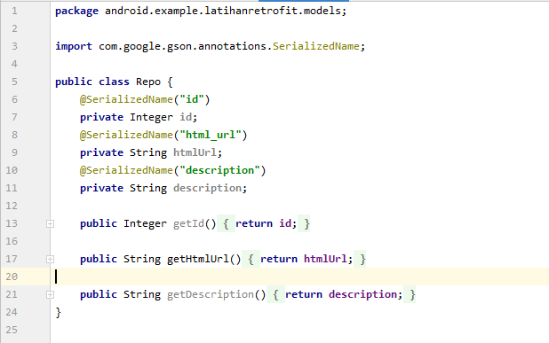

# 13 - Retrofit

## Tujuan Pembelajaran

1. Mahasiswa mampu mengonfigurasi retrofit pada Android
2. Mahasiswa mampu melakukan request ke RESTful API menggunakan retrofit

## Hasil Praktikum

Silakan buat New Project di Android Studio dengan nama LatihanRetrofit 

  
 

Tambahkan izin koneksi internet di AndroidManifest.xml 

 

Tambahkan dependencies library Retrofit, converter-gson, dan compileOptions. 

 

Untuk menambahkan library dan dependencies masuk ke Menu Build -> Edit Libraries and Dependencies

 

Pada Project Structure window yang terbuka klik tanda plus (+) pada Menu Dependencies Sub-Menu Declared Dependencies, kemudian pilih Library Dependencies

 

Input "retrofit" pada search column kemudian klik button Search, pilih com.square.retrofit2 pada Artifact  Name retrofit Versions 2.9.0

 

Lakukan hal yang sama pada langkah sebelumnya dengan input converter-gson, kemudian klik OK

 

Tunggu proses sync gradle selesai, dependencies akan otomatis ditambahkan pada file build.gradle (Module:app)

 

Buatlah package bernama services lalu buat class interface didalamnya. 

 

Buatlah package bernama models lalu buat class POJO didalamnya 

 

Tambahkan EditText pada activity_main untuk menyediakan input username bagi user sehingga program menjadi dinamis 

 

Buat sebuah button di sebelah EditText sebagai tombol setelah user menginputkan parameter 

 

Pada methdod onCreate tambahkan code untuk inflate layout activity_main.xml menggunakan DataBinding 

 

Tambahkan onClickListener untuk menghandle click pada button Search yang dilakukan oleh user yaitu melakukan get pada EditText yang merupakan parameter input user 

 

Buat recyclerview sebagai layout manager untuk menangani view yang akan ditampilkan setelah data didapatkan melalui proses GET 

 

Tambahkan TextView untuk menyediakan list dari data dalam recyclerview 

 

Buat adapter baru dengan mengextends RecyclerView.Adapter serta tambahkan nama ViewHolder yang akan digunakan 

 

Tambahkan method setData untuk menerima data dari api kemudian disimpan dalam variable repoList yang merupakan List dari class interface Repo 

 

Tambahkan code pada onCreateViewHolder untuk melakukan inflate pada layout row_data.xml 

 

Tambahkan juga code untuk untuk mengikat data antara repoList dengan holder htmlUser yang merupakan list dalam recyclerview untuk menampilkan data 

 

Tambahkan code brikut untuk melakukan proses request ke API 

 

Tambahkan code berikut untuk menampilkan loading ketika proses request ke RestAPI 

 

Buat TextView untuk memberitahukan ke user jika gagal request ke REST API 

 

Run your app, input the valid and invalid user's GitHub to see what the application would do. 

  

  

  

  

  

