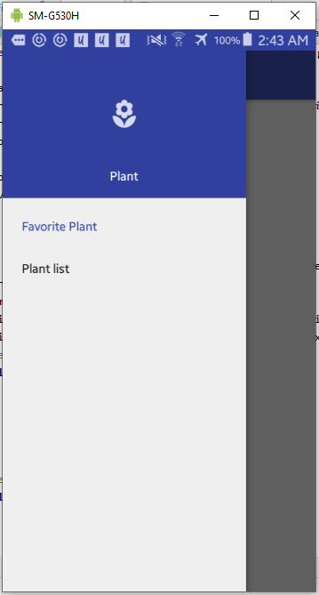
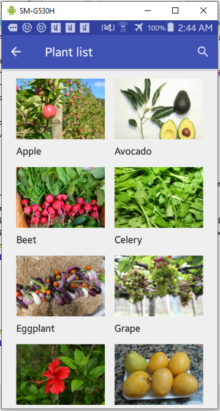
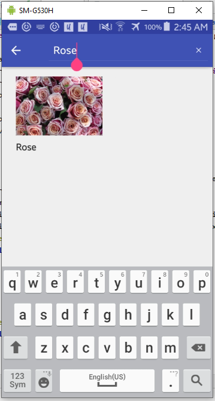
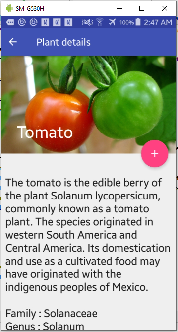
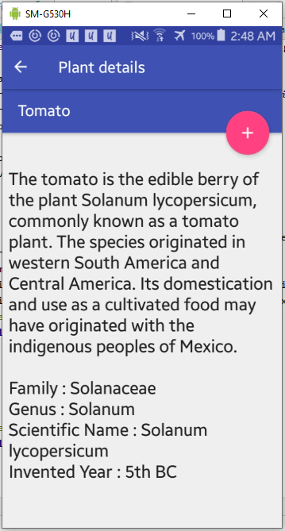
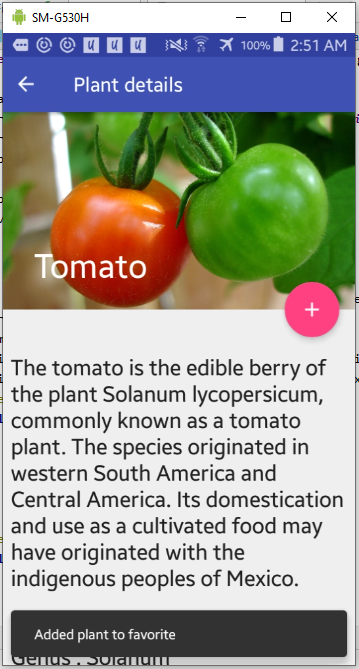
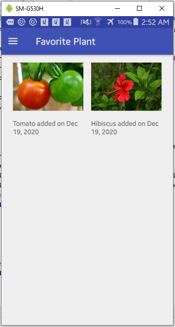

# 14 - Project

## Judul / Nama Aplikasi

Plant Information

- Link [APK Signed](https://github.com/hunaynr/mobile-3e-18/blob/master/docs/14_project/release/Plant.apk)
- Link [source code](https://github.com/hunaynr/mobile-3e-18/tree/master/src)

Bahasa Pemrograman : Java

## Deskripsi Aplikasi

- Memberikan wawasan tentang keberagaman flora yang ada di dunia dengan spesifik scientific name, family, genus, dan species beserta corresponding plant image
- Memberikan pengalaman yang menarik bagi mahasiswa dalam mendapatkan informasi tentang flora langsung melalui aplikasi pada smartphone
- Menumbuhkan minat atau ketertarikan mahasiswa untuk menggali dan mempelajari dunia flora lebih menyeluruh

## Identitas Pengembang (Developer)

- NIM: 1841720148
- Nama: Hunayn Risatayn
- Kelas: TI-3E

## Fitur-fitur Aplikasi

- Fitur Navigation yang digunakan untuk berpindah dari satu fragment/activity ke fragment destination yang lain. Pada aplikasi ini navigasi berfungsi untuk berpindah dari fragment favorite ke plant_list kemudian plant_detail 

 

- Fitur Plant list yang memanfaatkan Recyclerview untuk menampilkan list data dengan jumlah yang besar agar lebih efektif 

 

- Fitur Search pada plant list yang melakukan pencarian dengan query SELECT * FROM dengan parameter berupa input user dalam SearcView pada room database device 

 

- Pada layout plant_detail memanfaatkan DataBinding untuk melekatkan data menggunakan adapter dari room database dengan layout plant_detail. Binding Components dalam layout ini adalah ImageView untuk menampilkan image dan TextView untuk menampilkan detail deskripsi dari plant yang dilakukan select 

  
 

- Fitur Add to Favorite untuk menambahkan ke favorite yaitu melakukan insert ke dalam room database device pada plant yang dipilih, kemudian akan menapilkan SnackBar untuk memberikan konfirmasi ke user bahwa plant telah ditambahkan ke list favorite 

 

- List Favorite digunakan untuk menampilkan data favorite plant yang telah ditambahkan sebelumnya beserta tanggal dilakukan penambahan ke favorite dengan melakukan SELECT * FROM dari room database

 

## Saran

Untuk pengembangan selanjutnya saya sudah berusaha menambahkan fitur sorting untuk menampilkan data urut ASC dan DESC dan telah berhasil menampilkan secara urut tetapi masih belum bisa dilakukan secara dinamis, jadi harus mengganti return value dulu, barulah fitur dapat berfungsi, return value yang diganti adalah pada List\<Plant\> yang akan dikaitkan pada LiveData untuk memberikan notifikasi pada Observer jika data berubah setelah diurutkan 

## Kesimpulan

Proses development dari aplikasi ini dapat membantu saya dalam mengimplementasikan konsep teori dari proses penataan layout.xml, inflate layout dari activity, penghubung data dengan UI dengan adaper, penggunaan ViewModel, Navigation untuk perpindahan destination, DataBinding yang membantu untuk mengikat data hingga terakhir adalah Room yang komponennya adalah Database, Entity/table dan DAO/query untuk berhubungan dengan database. Ilmu tersebut semoga dapat bermanfaat kedepannya baik dalam perkuiahan semester berikutnya hingga pada saat bekerja. 

## Sumber Data / Referensi 

- Sumber Data yang digunakan adalah file berekstensi ( .json)
- Referensi belajar

https://developer.android.com/training/data-storage/room  

https://developer.android.com/guide/navigation  

https://developer.android.com/guide/fragments  

https://developer.android.com/topic/libraries/data-binding  